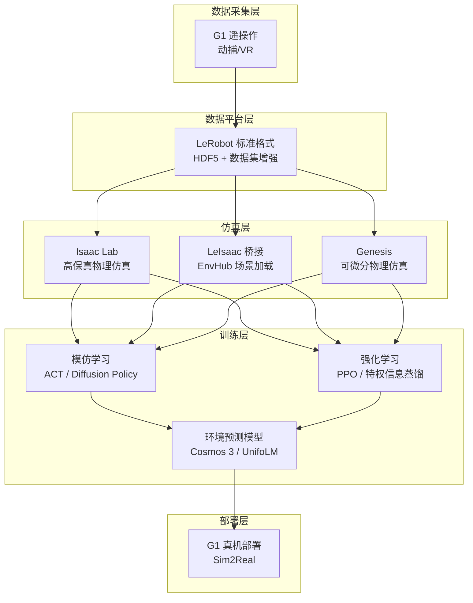
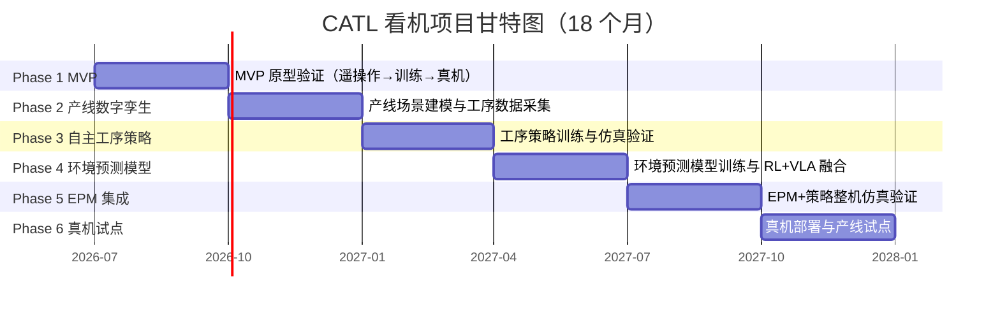
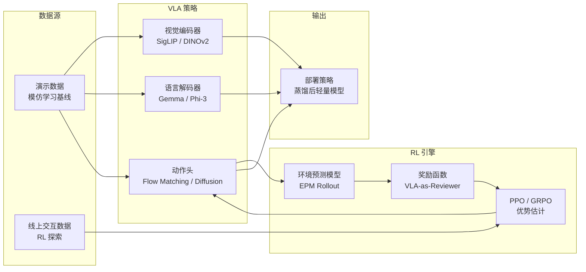

# CATL 看机双足人形机器人开发规划

> 基于 Unitree G1 双足人形机器人（六维力+触觉灵巧手+动捕服+VR），面向 CATL 电池产线看机场景的 **18 个月开发规划**。团队 4 人，按 **6 个阶段、每阶段 3 个月**推进：MVP 原型验证 → 产线数字孪生 → 自主工序策略 → 环境预测模型与 RL+VLA → EPM 集成整机验证 → 真机产线试点。

**核心工具链**：[[LeRobot]] 数据格式 + [[Isaac Lab]] 仿真 + [[遥操作（Teleoperation）]] 采集 + [[VLA（视觉-语言-动作模型）]] 策略 + [[NVIDIA Cosmos]] 环境预测模型

## 硬件资产概览

| 硬件           | 核心配置                                | 项目归属 | 用途                            |
| -------------- | --------------------------------------- | -------- | ------------------------------- |
| **Unitree G1** | 六维力传感器 + 触觉灵巧手 + 动捕服 + VR | G1       | 双足行走 + 灵巧操作（看机主力） |

## 整体架构



## 总体时间线（6 阶段 × 3 个月）



## 阶段概览

| 阶段                 | 时间          | 主题                     | 里程碑验收标准                                   |
| -------------------- | ------------- | ------------------------ | ------------------------------------------------ |
| **Phase 1**          | 第 1-3 月     | MVP 原型验证             | M1：G1 完成 1 个桌面任务端到端闭环               |
| **Phase 2**          | 第 4-6 月     | 产线数字孪生             | M2：产线场景可交互操作，工序数据 200+ 轨迹       |
| **Phase 3**          | 第 7-9 月     | 自主工序策略             | M3：仿真自主完成 1 个完整工序，成功率 ≥70%       |
| **Phase 4**          | 第 10-12 月   | 环境预测模型与 RL+VLA 融合   | M4：EPM 基线收敛，增强策略超越模仿学习基线        |
| **Phase 5**          | 第 13-15 月   | EPM 集成整机验证          | M5：整机仿真验证通过，达到真机试点门槛           |
| **Phase 6**          | 第 16-18 月   | 真机产线试点与交付       | M6：真机完成看机工序（简化版），成功率 ≥60%      |

---

## Phase 1：MVP 原型验证（第 1-3 月）

### 目标

打通"遥操作→数据采集→仿真训练→真机部署"端到端 pipeline，用桌面场景验证 G1 灵巧操作能力，尽早暴露并量化 Sim2Real 风险。

### 关键任务

- G1 硬件联调（开机自检、关节标定）与动捕服/VR 遥操作搭建，实现动捕→G1 实时跟随
- Isaac Lab 仿真环境搭建（G1 URDF + 物理参数），部署 unitree_lerobot 数据采集管线与 LeIsaac 桥接
- 桌面场景（电池抓取/摆放）采集 ≥50 条演示数据，训练 ACT 策略并在仿真中验证成功率
- 首次 Sim2Real 部署：G1 真机运行训练策略，基于失败回放迭代数据集与策略
- 尝试宇树 RL Lab 用 RL 微调 G1 运动控制，预研行走+操作联合策略
- 失败模式分析与文档沉淀（常见问题手册），MVP 演示与阶段评审

### 里程碑

| 里程碑               | 时间      | 验收标准                                                         |
| -------------------- | --------- | ---------------------------------------------------------------- |
| **M1: MVP 端到端闭环** | 第 3 月末 | G1 完成 1 个桌面任务（端到端：遥操作→训练→仿真验证→真机部署） |

---

## Phase 2：产线数字孪生（第 4-6 月）

### 目标

构建 CATL 电池产线数字孪生场景，选定 1 个具体工序，在仿真中可交互操作并完成工序演示数据采集。

### 关键任务

- 产线现场调研与需求确认：选定工序（优先电池外观检测或电芯取放），输出工序定义文档
- 产线 3D 资产收集与建模（工位、传送带、电池、夹具），Isaac Lab 场景搭建（刚体物理属性、碰撞网格优化）
- Genesis 产线场景并行搭建，作为对标与快速迭代环境
- G1 双臂交互验证（可达空间、运动规划），输出场景可用性报告
- 采集产线工序演示数据（仿真遥操作或程序化生成）200+ 轨迹，接入数据增强管线

### 关键决策

- **Isaac Lab vs Genesis**：以 Isaac Lab 为主（高保真），Genesis 为辅助验证（快速迭代）。若 Genesis 成熟度足够，Phase 4 可迁移至 Genesis 做环境预测模型训练环境。
- **工序选择原则**：选一个动作组合相对简单、评估指标清晰的工序（如电池外观检测：走到工位→拿起电池→旋转检查→放回），避免一开始就选需要全身协调的复杂工序。

### 里程碑

| 里程碑             | 时间      | 验收标准                                                                              |
| ------------------ | --------- | ------------------------------------------------------------------------------------- |
| **M2: 产线数字孪生就绪** | 第 6 月末 | CATL 电池产线场景建模完成（含工位、传送带、电池工件），Isaac Lab/Genesis 中可交互操作，工序数据集 200+ 轨迹 |

---

## Phase 3：自主工序策略（第 7-9 月）

### 目标

基于产线数据集训练自主工序策略，在仿真中完成一个完整工序并达到 ≥70% 成功率。

### 关键任务

- 基于产线数据集训练 ACT/Diffusion Policy 工序策略 v1
- RL 微调（PPO + 特权信息蒸馏 + 域随机化）得到工序策略 v2
- 多环境并行验证（50+ 并发仿真）统计成功率
- Sim2Real 预研：G1 真机简单产线操作测试（非完整工序），量化 Sim2Real gap
- 工序策略迭代至 ≥70% 仿真成功率

### 里程碑

| 里程碑           | 时间      | 验收标准                                                    |
| ---------------- | --------- | ----------------------------------------------------------- |
| **M3: 自主工序** | 第 9 月末 | 仿真中机器人自主完成 1 个完整工序，成功率 ≥70%             |

---

## Phase 4：环境预测模型与 RL+VLA 融合（第 10-12 月）

### 目标

基于 Cosmos 3 / UnifoLM 训练面向产线的环境预测模型并达到收敛，启动 RL+VLA 四条融合路线探索（详见下文「RL 与 VLA 结合方法」）。

### 关键任务

- 数据基建：产线数据 + 仿真 rollout 数据统一接入环境预测模型训练集
- 训练产线环境预测模型（优先小尺寸 UnifoLM，Cosmos 用 LoRA 微调），验证视频预测损失收敛与动作条件化正确
- 路线一落地：用 VLA 预训练权重（π0/Cosmos）初始化 RL 策略，冻结视觉 backbone，RL 微调动作头
- 路线二并行：VLA-as-Reviewer 语义级奖励信号，替代部分奖励工程
- EPM-in-the-Loop 预研：VLA 采样 → EPM 想象多步 → RL 评估

### 里程碑

| 里程碑               | 时间       | 验收标准                                                                 |
| -------------------- | ---------- | ------------------------------------------------------------------------ |
| **M4: EPM 基线 + 策略增强** | 第 12 月末 | 环境预测模型达到收敛（视频预测损失稳定，动作条件化正确）；EPM 增强策略在仿真中超越纯模仿学习基线（成功率 +10% 或泛化性提升） |

---

## Phase 5：EPM 集成与整机验证（第 13-15 月）

### 目标

将环境预测模型与策略深度集成，在产线仿真中完成 G1 整机（行走 + 操作 + 异常预测）全流程验证，达到真机试点门槛。

### 关键任务

- EPM-in-the-Loop 落地：VLA 策略 + EPM rollout 的想象式 RL 训练
- GRPO / RECAP 风格优势条件化 VLA 微调（真机数据回流后）
- 整机仿真验证：G1 从进入产线→执行工序→异常处理的全流程仿真测试
- 域随机化强化 + 真机数据混合训练，进一步压缩 Sim2Real gap
- 部署策略蒸馏为轻量模型，适配 G1 机载算力

### 里程碑

| 里程碑             | 时间       | 验收标准                                                       |
| ------------------ | ---------- | -------------------------------------------------------------- |
| **M5: EPM 集成整机验证** | 第 15 月末 | EPM 辅助策略在产线仿真中完成整机全流程验证，成功率与稳定性达到真机试点门槛 |

---

## Phase 6：真机产线试点与交付（第 16-18 月）

### 目标

在 G1 真机上完成简化版看机工序试点，验证 EPM 辅助策略的现场可用性，完成项目交付。

### 关键任务

- 产线现场部署：G1 进场、摄像头（×4-6）与通信链路搭建
- 真机看机工序试点（简化版）：外观检测/取放，迭代至 ≥60% 成功率
- 安全冗余与异常兜底机制（人工接管、急停、异常报警）
- 交付：操作手册、训练数据/模型资产、Sim2Real 迁移文档

### 里程碑

| 里程碑             | 时间       | 验收标准                                                     |
| ------------------ | ---------- | ------------------------------------------------------------ |
| **M6: 真机试点交付** | 第 18 月末 | EPM 辅助策略在 G1 真机完成看机工序（简化版），成功率 ≥60%，项目交付验收 |

---

## RL 与 VLA 结合方法

Phase 4-6 的核心技术路线是将**强化学习（RL）**与**视觉-语言-动作模型（VLA）**深度融合，弥补纯模仿学习的局限性。

### 为什么需要 RL + VLA

| 方法 | 优势 | 局限 |
|------|------|------|
| **纯模仿学习（ACT/DP）** | 策略稳定，行为贴近演示 | 泛化性差，超出分布时无恢复能力 |
| **纯 RL（PPO/GRPO）** | 可探索最优策略，泛化强 | 样本效率极低，稀疏奖励下难收敛 |
| **VLA 基础模型** | 语义理解强，多任务泛化 | 动作精度不足，难以处理接触-rich 操作 |
| **RL + VLA** | 结合两者优势 | 训练复杂度增加，需精心设计接口 |

### 四条融合路线（并行探索）

#### 路线一：VLA 作为 RL 的初始化先验

```
VLA 预训练（大量互联网数据）→ 冻结视觉/语言编码器 → 初始化 RL 策略头 → PPO/GRPO 在线微调
```

- **适用阶段**：Phase 4 起
- **实现方式**：用 Cosmos 3 或 π0 的预训练权重初始化策略网络，冻结视觉 backbone，仅用 RL 微调动作头
- **优势**：大幅降低 RL 探索空间（从零到有语义指导），样本效率提升 10-100x
- **工具链**：OpenPI 的 π0 RL 微调流程、TRL（Transformer RL）库

#### 路线二：VLA 作为 RL 的奖励信号（VLA-as-Reviewer）

```
动作执行 → VLA 评分（语义合理性 + 任务完成度）→ 作为 RL 奖励函数 → PPO 优化
```

- **适用阶段**：Phase 4 起并行
- **实现方式**：利用 VLA 的 VLM 能力对执行结果做语义级评估（如"电池是否已对齐工位"），替代传统工程化奖励函数设计
- **优势**：避免繁琐的奖励工程（reward engineering），奖励信号更鲁棒
- **注意**：VLA 评分延迟可能影响 RL 训练速度，需做异步评分缓存

#### 路线三：环境预测模型作为 RL 与 VLA 的桥梁（EPM-in-the-Loop）

```
VLA 策略采样 → 环境预测模型（Cosmos 3）想象多步结果 → RL 评估想象轨迹 → 更新 VLA 策略
```

- **适用阶段**：Phase 4 末启动，Phase 5 落地
- **实现方式**：VLA 推理 → EPM rollout 预测未来 N 帧 → 奖励函数评估 EPM 想象结果 → RL 更新 VLA 策略
- **优势**：在仿真/想象中做 RL 探索，避免真机试错成本；利用 EPM 的可微分性做高效梯度传播
- **工具链**：Cosmos 3 的 WAM + 后训练框架、UnifoLM-WMA-0 的 action-conditioned 预测

#### 路线四：GRPO / RECAP 风格的优势条件化 VLA

```
VLA 策略采样多条轨迹 → 每条轨迹计算优势（成功/失败）→ 优势加权更新 VLA 策略
```

- **适用阶段**：Phase 5 起（真机数据回流后）
- **实现方式**：类似 GRPO（组相对策略优化）和 RECAP（优势条件化 RL）的思路——让 VLA 策略同时输出动作和预测回报，用实际执行结果的优势值加权更新
- **优势**：不需要独立 critic 网络，训练流程简单；天然适合 VLA 的 next-token-prediction 范式
- **工具链**：RECAP 论文实现、DeepSeek GRPO 框架（适配 VLA 输出头）

### 训练流程



### 实验优先级建议

| 优先级 | 路线 | 预期收益 | 难度 | 建议开始时间 |
|:------:|------|:--------:|:----:|:-----------:|
| P0 | 路线一：VLA 初始化 RL | 高（样本效率提升最直接） | 低 | Phase 4 开始 |
| P1 | 路线三：EPM-in-the-Loop | 高（安全探索） | 高 | Phase 4 末启动 |
| P2 | 路线四：GRPO 风格优势 VLA | 中 | 中 | Phase 5 开始 |
| P3 | 路线二：VLA-as-Reviewer | 中（替代奖励工程） | 低 | Phase 4 并行 |

---

## 人员分工

### 角色定义

| 角色 | 职责 | 技能要求 | 硬件配置 |
|------|------|----------|----------|
| **A（硬件工程师）** | G1 硬件联调、遥操作搭建、真机部署、数据采集 | 机器人控制、ROS2、动捕系统 | G1 机器人 + 动捕服 + VR |
| **B（仿真工程师）** | Isaac Lab/Genesis 场景搭建、Sim2Real、并行验证 | URDF/SDF、物理仿真、域随机化 | GPU 工作站（RTX 4090） |
| **C（算法工程师）** | 策略训练（ACT/DP/PPO）、VLA 模型微调、RL 优化 | PyTorch、模仿学习、强化学习 | GPU 服务器（A100/H100） |
| **D（基建工程师）** | 数据管线、LeRobot 集成、实验管理、文档沉淀 | 数据工程、MLOps、HDF5 | GPU 工作站（训练用） |

### 分阶段投入

- **Phase 1-2（M1-M2）**：4 人全员投入 MVP 闭环与产线场景搭建
- **Phase 3（M3）**：4 人投入工序策略训练，A 并行开展产线现场调研
- **Phase 4-5（M4-M5）**：4 人分两组——C+D 负责环境预测模型与 RL+VLA 训练，A+B 负责仿真集成与真机预研
- **Phase 6（M6）**：全员投入真机试点，A 主导现场部署，C 负责真机策略调优

### 硬件资源需求

| 阶段 | 需求 | 说明 |
|------|------|------|
| **Phase 1-2** | GPU 工作站 ×2 | B 仿真 + C 训练，RTX 4090 级别即可 |
| **Phase 3** | GPU 服务器 ×1 | 产线仿真并行验证，需 48GB+ 显存 |
| **Phase 4-5** | GPU 集群 / 云 GPU | Cosmos 3（64B）微调需 A100/H100；可用 LoRA 降低需求 |
| **Phase 6** | 摄像头 ×4-6 + 现场工作站 | 产线试点部署，提前部署在 CATL 产线工位 |

---

## 风险与缓解

| 风险                | 概率 | 影响 | 缓解措施                                             |
| ------------------- | :--: | :--: | ---------------------------------------------------- |
| G1 灵巧手力控不稳定 |  中  |  高  | Phase 1 做充分遥操作测试；备选方案：用夹爪替代灵巧手 |

| 仿真到真机（Sim2Real）差距大 | 高 | 高 | 域随机化 + 真机数据混合训练；Phase 1 尽早跑通 Sim2Real，Phase 3/5 持续量化 gap |
| 4 人产能瓶颈 | 中 | 高 | 严禁并行多个大方向；每阶段聚焦 1-2 条主线；工具链尽量复用 |
| 产线场景建模工作量大 | 中 | 中 | 用 Genesis 的生成式 AI 能力加速建模；优先使用现成 3D 资产库 |
| 环境预测模型训练计算资源不足 | 高 | 高 | 优先训练小尺寸 UnifoLM；Cosmos 微调用低秩适配（LoRA）；利用云 GPU |
| 真机现场调试周期不可控 | 中 | 高 | Phase 6 预留现场调试时间；简化版工序先行；提前与 CATL 协调产线窗口期 |

---

## 相关

- [[Isaac Lab]] — 高保真物理仿真环境
- [[LeRobot]] — 机器人学习框架与数据格式
- [[遥操作（Teleoperation）]] — 人类示教数据采集方式
- [[VLA（视觉-语言-动作模型）]] — 语义理解+动作生成的核心策略架构
- [[流匹配（Flow Matching）]] — VLA 动作生成的生成式方法
- [[NVIDIA Cosmos]] — 环境预测模型平台
- [[Genesis]] — 可微分物理引擎（备选仿真环境）
- [[OpenARM]] — 开源机械臂（桌面操作备选硬件）
- [[GR00T N1.5]] — NVIDIA 机器人基础模型
- [[锂电池产线具身机器人部署规划]] — 另一份产线部署规划（两人团队版）

