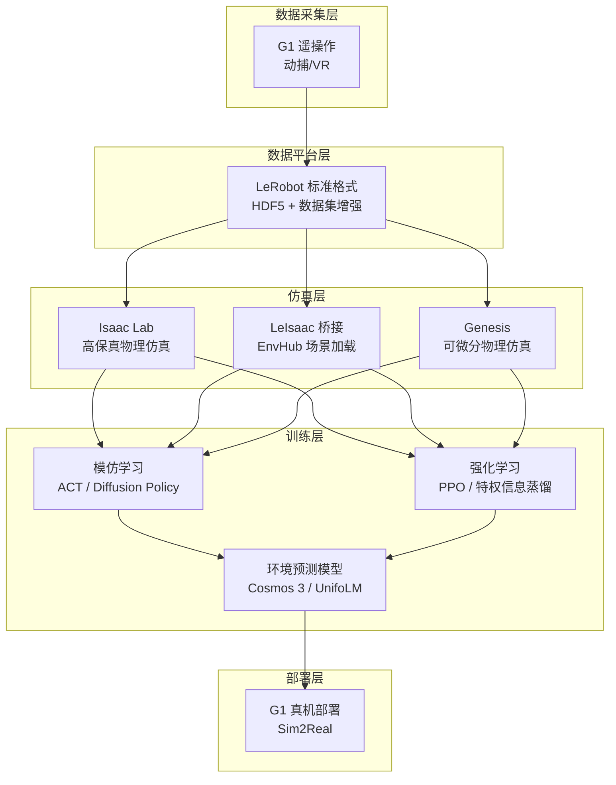
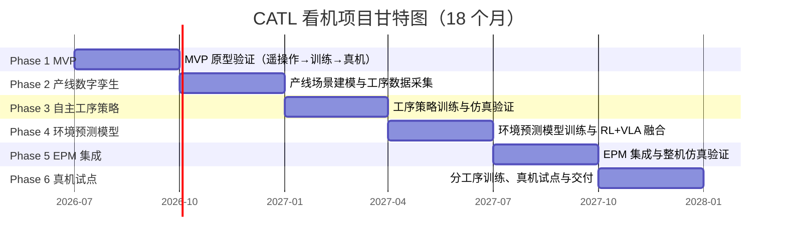
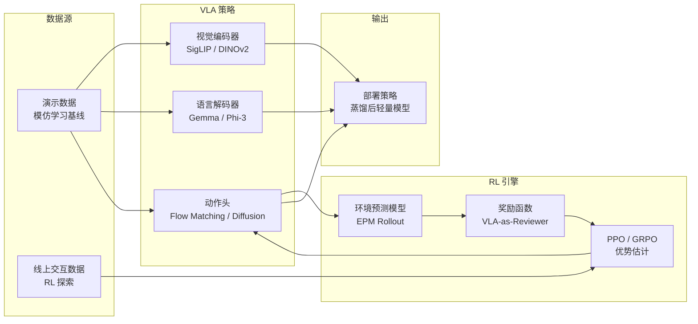

# CATL 看机双足人形机器人开发规划

> 基于 Unitree G1 双足人形机器人（六维力+触觉灵巧手+动捕服+VR），面向 CATL 电池产线看机场景的 **18 个月开发规划**。团队 5 人为核心执行班底，按 **6 个阶段、每阶段 3 个月**推进：MVP 原型验证 → 产线数字孪生 → 自主工序策略 → 环境预测模型与 RL+VLA → EPM 集成整机验证 → 分工序训练、真机试点与交付。  iqc

**核心工具链**：\[\[LeRobot]] 数据格式 + \[\[Isaac Lab]] 仿真 + \[\[遥操作（Teleoperation）]] 采集 + \[\[VLA（视觉-语言-动作模型）]] 策略 + \[\[NVIDIA Cosmos]] 环境预测模型

## 硬件资产概览

| 硬件             | 核心配置                      | 项目归属 | 用途                |
| -------------- | ------------------------- | ---- | ----------------- |
| **Unitree G1** | 六维力传感器 + 触觉灵巧手 + 动捕服 + VR | G1   | 双足行走 + 灵巧操作（看机主力） |

## 整体架构



## 总体时间线（6 阶段 × 3 个月）



## 阶段概览

| 阶段          | 时间        | 主题                | 里程碑目标                                      |
| ----------- | --------- | ----------------- | -------------------------------------------- |
| **Phase 1** | 第 1-3 月   | MVP 原型验证          | M1：G1 完成 1 个桌面任务端到端闭环                        |
| **Phase 2** | 第 4-6 月   | 产线数字孪生            | M2：产线场景可交互操作，工序数据 200+ 轨迹                    |
| **Phase 3** | 第 7-9 月   | 自主工序策略            | M3：仿真自主完成 1 个完整工序，成功率 ≥70%                   |
| **Phase 4** | 第 10-12 月 | 环境预测模型与 RL+VLA 融合 | M4：EPM 基线收敛，增强策略超越模仿学习基线                     |
| **Phase 5** | 第 13-15 月 | EPM 集成整机验证        | M5：整机仿真验证通过，达到真机试点门槛                         |
| **Phase 6** | 第 16-18 月 | 分工序训练、真机试点与交付     | M6：A/B/C/D 各自完成 1 个工序训练与验证（E 负责 OpenARM/VLN 支持），看机主工序真机成功率 ≥60%，完成项目交付 |

---

## Phase 1：MVP 原型验证（第 1-3 月）

### 目标

打通「遥操作→数据采集→仿真训练→真机部署」端到端 pipeline，用桌面场景验证 G1 灵巧操作能力；并行推进 OpenARM 桌面操作备选硬件的能力探知线，并完成本地算力验证工作站采购，为后续 LoRA/大模型微调打底。

### 关键任务

- G1 硬件联调（开机自检、关节标定）与动捕服 遥操作搭建，实现动捕→G1 实时跟随；灵巧手力控需充分压力测试，备选方案：用夹爪替代灵巧手。
- G1 VR 遥操作专用通道搭建，实现 VR→G1 实时跟随；与动捕路线并行推进，分别验证两条输入通道的延迟与可用性。
- Isaac Lab 仿真环境搭建（G1 URDF + 桌面各种物体包括电池混摆抓取）：优先复用官方 G1 URDF；通过 RL 算法训练机器人准确抓取物体并放置到盘子中，最终部署到实体机器人 G1，使用参数辨识和校准的方法减少 Sim2Real gap；注意方块物体物理参数保真度直接影响下游 Sim2Real。
- 部署 unitree/lerobot 数据采集管线，最好能兼容使用第一视角视频。
- 桌面场景（方块物品抓取/摆放，电池外观检查）采集 ≥200 条演示数据，训练 GR00T 系列算法的模仿学习，探索不同算法的差异。
- -桌面场景（方块物品抓取/摆放，电池外观检查）采集 ≥200 条演示数据，训练  PI（π）系列算法的模仿学习，探索不同算法的差异。
- 首次 Sim2Real 部署：G1 真机运行训练策略，基于失败回放迭代数据集与策略，量化首个 Sim2Real gap；多人共用 G1 需预约时段避免干扰。
- OpenARM 能力探知：数据采集、模型训练、模型部署全流程验证，探索不同算法的模仿学习实现抓取苹果等物品；独立于 G1 主线，PC 侧运行可避免真机争用。
- 本地算力验证工作站采购与部署（RTX PRO 6000 D）：5090 显存不够支持 LoRA 训练，即使后续使用 H200，前期验证阶段也需先在本地工作站渲染。
- 文档记录常见问题手册、MVP 演示；输出 FAQ 手册

### 交付物

- ≥200 条桌面演示数据集（LeRobot 标准格式，兼容第一视角视频）
- ACT / PI（π）系列模仿学习策略模型与不同算法对比结论
- G1 真机 Sim2Real 部署记录 + 首个 gap 量化数据
- OpenARM 抓取任务全流程验证报告（数据采集→训练→部署）
- 常见问题 FAQ 手册、MVP 演示

### 风险与应对

- **G1 灵巧手力控不稳定**（中/高，R1）：Phase 1 做充分遥操作压力测试；备选方案：用夹爪替代灵巧手。
- **LoRA 训练算力不足**（5090 显存不够、H200 尚未到位，R7）：采购 RTX PRO 6000 D 作为本地验证机；大模型 LoRA 微调后置到云 GPU/H200。
- **多人共用同一台 G1 互相干扰**（R8）：提前预约时段、优先保障关键路径任务；OpenARM 线 PC 侧独立运行避免真机争用。

### 里程碑

| 里程碑               | 时间     | 目标                                |
| ----------------- | ------ | ----------------------------------- |
| **M1: MVP 端到端闭环** | 第 3 月末 | G1 和openArm完成 1 个桌面任务（端到端：遥操作→训练→仿真验证→真机部署） |

> M1 未达成则制定 Phase 2 补救计划，并在阶段评审时确认。

---

## Phase 2：产线数字孪生，仿真，训练一个真实场景任务（第 4-6 月）

### 目标

构建 CATL 电池产线或者肇庆工厂数字孪生场景，选定 1 个具体工序和任务，在仿真中可交互操作并完成工序演示数据采集；同步预研 G1 行走+操作联合控制策略，完成 Isaac Lab  / Genie Sim 多平台对标与 VLA 算法训练部署验证。

### 关键任务

- 产线现场调研与需求确认：选定工序（初步选定优先电池外观缺陷检测或不合格电芯分类取放），输出工序定义 SOP 文档；提前与 CATL 协调产线窗口期，选动作组合简单、评估指标清晰的工序。
- 尝试宇树 RL Lab 用 RL 微调 G1 运动控制，预研行走+操作联合策略；本阶段仅预研、不扩大范围（PPO / 特权信息蒸馏）。
- 产线 3D 资产收集与建模（质检台、传送带、电池、夹具），Isaac Lab 场景搭建（刚体物理属性、碰撞网格优化）；优先使用现成 3D 资产库降低建模工作量。
- 引入结构工程师支持数字仿真环境创建：工位/夹具/治具 CAD 建模、尺寸、关节限位、惯量、质量、质心校核、数字仿真环境结构还原与现场结构适配，提升仿真场景可落地性；Phase 2 为结构支持重点窗口。
- 部署 Genie Sim 仿真平台，利用 LLM 和 RAG 并行搭建和生成产线场景，作为对标与快速迭代环境；Isaac Lab / Genie Sim 双线并行对标，降低单一仿真平台依赖。
- G1 双臂交互验证（可达空间、运动规划），输出场景可用性报告；验证选定工序可达性，不可达则需调整工位布局或更换工序。
- 实体机器人采集产线工序演示数据（包括仿真遥操作或程序化增强生成）≥200 条轨迹，接入 LeRobot 数据增强管线。
- 基于各种来源的数据训练不同的 VLA 算法——PI（π）系列——给出评估报告并部署。
- 基于各种来源的数据训练不同的 VLA 算法——GR00T 系列——给出评估报告并部署。

### 交付物

- 工序定义 SOP 文档 + CATL 产线窗口期协调记录
- 产线数字孪生场景二平台版本：Isaac Lab（高保真）/ Genie Sim，含工位、传送带/卷绕机、电池工件、夹具
- 结构支持交付物：CAD 模型与尺寸约束包（关节限位、惯量、质量、质心校核）
- ≥200 条工序演示轨迹数据集（LeRobot 格式 + 增强管线接入记录）
- VLA 多算法评估报告（GR00T / PI / ACT 对比）与部署版本策略
- G1 双臂可达空间与场景可用性报告

### 风险与应对

- **产线场景建模工作量大**（中/中，R4）：用 Genesis 的生成式 AI 能力加速建模；优先使用现成 3D 资产库；结构工程师重点支持窗口降低手工建模量。

### 里程碑

| 里程碑              | 时间     | 目标                                                                 |
| ---------------- | ------ | -------------------------------------------------------------------- |
| **M2: 产线数字孪生就绪** | 第 6 月末 | CATL 电池产线场景建模完成（含工位、卷绕机、电池工件，质检台），Isaac Lab/Genesis 中可交互操作，工序数据集 200+ 轨迹，可以部署到实际产线 |

> M2 评审时同步归档场景可用性报告与工序定义文档。

---

## Phase 3：自主工序策略（第 7-9 月）

### 目标

基于产线数据集训练自主工序策略，在仿真中完成一个完整工序并达到 ≥70% 成功率。

### 关键任务

- 基于产线数据集训练 ACT/Diffusion Policy 工序策略 v1
- RL 微调（PPO + 特权信息蒸馏 + 域随机化）得到工序策略 v2
- 多环境并行验证（50+ 并发仿真）统计成功率
- Sim2Real 预研：G1 真机简单产线操作测试（非完整工序），量化 Sim2Real gap
- 工序策略迭代至 ≥70% 仿真成功率

### 里程碑

| 里程碑          | 时间     | 目标                        |
| ------------ | ------ | --------------------------- |
| **M3: 自主工序** | 第 9 月末 | 仿真中机器人自主完成 1 个完整工序，成功率 ≥70% |

---

## Phase 4：环境预测模型与 RL+VLA 融合（第 10-12 月）

### 目标

基于 Cosmos 3 / UnifoLM 训练面向产线的环境预测模型并达到收敛，启动 RL+VLA 四条融合路线探索（详见下文「RL 与 VLA 结合方法」）。

### 关键任务

- 数据基建：产线数据 + 仿真 rollout 数据统一接入环境预测模型训练集
- 训练产线环境预测模型（优先小尺寸 UnifoLM，Cosmos 用 LoRA 微调），验证视频预测损失收敛与动作条件化正确
- 路线一落地：用 VLA 预训练权重（π0/Cosmos）初始化 RL 策略，冻结视觉 backbone，RL 微调动作头
- 路线二并行：VLA-as-Reviewer 语义级奖励信号，替代部分奖励工程
- EPM-in-the-Loop 预研：VLA 采样 → EPM 想象多步 → RL 评估

### 里程碑

| 里程碑                   | 时间      | 目标                                                                |
| --------------------- | ------- | ------------------------------------------------------------------- |
| **M4: EPM 基线 + 策略增强** | 第 12 月末 | 环境预测模型达到收敛（视频预测损失稳定，动作条件化正确）；EPM 增强策略在仿真中超越纯模仿学习基线（成功率 +10% 或泛化性提升） |

---

## Phase 5：EPM 集成与整机验证（第 13-15 月）

### 目标

将环境预测模型与策略深度集成，在产线仿真中完成 G1 整机（行走 + 操作 + 异常预测）全流程验证，达到真机试点门槛。

### 关键任务

- EPM-in-the-Loop 落地：VLA 策略 + EPM rollout 的想象式 RL 训练
- GRPO / RECAP 风格优势条件化 VLA 微调（真机数据回流后）
- 整机仿真验证：G1 从进入产线→执行工序→异常处理的全流程仿真测试
- 域随机化强化 + 真机数据混合训练，进一步压缩 Sim2Real gap
- 部署策略蒸馏为轻量模型，适配 G1 机载算力

### 里程碑

| 里程碑                | 时间      | 目标                                    |
| ------------------ | ------- | --------------------------------------- |
| **M5: EPM 集成整机验证** | 第 15 月末 | EPM 辅助策略在产线仿真中完成整机全流程验证，成功率与稳定性达到真机试点门槛 |

---

## Phase 6：分工序训练、真机试点与交付（第 16-18 月）

### 目标

在 G1 真机上完成简化版看机工序试点；A/B/C/D 各自选定 1 个工序进行训练与验证（E 负责 OpenARM/VLN 支持），验证 EPM 辅助策略的现场可用性，完成项目交付。

### 关键任务

- A/B/C/D 各选定 1 个工序，形成 4 条并行训练与验证线；E 继续 OpenARM/VLN 支持，覆盖数据采集、策略训练、仿真评估与真机回放
- 真机产线试点（简化版）：优先完成看机主工序上线验证，并对其余 3 个工序完成仿真或半实物验证
- 产线现场部署：G1 进场、摄像头（×4-6）与通信链路搭建
- 安全冗余与异常兜底机制（人工接管、急停、异常报警）
- 交付：操作手册、训练数据/模型资产、Sim2Real 迁移文档

### 里程碑

| 里程碑             | 时间      | 目标                                                     |
| --------------- | ------- | -------------------------------------------------------- |
| **M6: 分工序试点交付** | 第 18 月末 | A/B/C/D 各自完成 1 个工序训练与验证闭环（E 负责 OpenARM/VLN 支持）；看机主工序在 G1 真机完成试点，成功率 ≥60%；项目交付验收 |

---

## RL 与 VLA 结合方法

Phase 4-6 的核心技术路线是将\*\*强化学习（RL）**与**视觉-语言-动作模型（VLA）\*\*深度融合，弥补纯模仿学习的局限性。

### 为什么需要 RL + VLA

| 方法                 | 优势          | 局限                    |
| ------------------ | ----------- | --------------------- |
| **纯模仿学习（ACT/DP）**  | 策略稳定，行为贴近演示 | 泛化性差，超出分布时无恢复能力       |
| **纯 RL（PPO/GRPO）** | 可探索最优策略，泛化强 | 样本效率极低，稀疏奖励下难收敛       |
| **VLA 基础模型**       | 语义理解强，多任务泛化 | 动作精度不足，难以处理接触-rich 操作 |
| **RL + VLA**       | 结合两者优势      | 训练复杂度增加，需精心设计接口       |

### 四条融合路线（并行探索）

#### 路线一：VLA 作为 RL 的初始化先验

```
VLA 预训练（大量互联网数据）→ 冻结视觉/语言编码器 → 初始化 RL 策略头 → PPO/GRPO 在线微调
```

- **适用阶段**：Phase 4 起
- **实现方式**：用 Cosmos 3 或 π0 的预训练权重初始化策略网络，冻结视觉 backbone，仅用 RL 微调动作头
- **优势**：大幅降低 RL 探索空间（从零到有语义指导），样本效率提升 10-100x
- **工具链**：OpenPI 的 π0 RL 微调流程、TRL（Transformer RL）库

#### 路线二：VLA 作为 RL 的奖励信号（VLA-as-Reviewer）

```
动作执行 → VLA 评分（语义合理性 + 任务完成度）→ 作为 RL 奖励函数 → PPO 优化
```

- **适用阶段**：Phase 4 起并行
- **实现方式**：利用 VLA 的 VLM 能力对执行结果做语义级评估（如"电池是否已对齐工位"），替代传统工程化奖励函数设计
- **优势**：避免繁琐的奖励工程（reward engineering），奖励信号更鲁棒
- **注意**：VLA 评分延迟可能影响 RL 训练速度，需做异步评分缓存

#### 路线三：环境预测模型作为 RL 与 VLA 的桥梁（EPM-in-the-Loop）

```
VLA 策略采样 → 环境预测模型（Cosmos 3）想象多步结果 → RL 评估想象轨迹 → 更新 VLA 策略
```

- **适用阶段**：Phase 4 末启动，Phase 5 落地
- **实现方式**：VLA 推理 → EPM rollout 预测未来 N 帧 → 奖励函数评估 EPM 想象结果 → RL 更新 VLA 策略
- **优势**：在仿真/想象中做 RL 探索，避免真机试错成本；利用 EPM 的可微分性做高效梯度传播
- **工具链**：Cosmos 3 的 WAM + 后训练框架、UnifoLM-WMA-0 的 action-conditioned 预测

#### 路线四：GRPO / RECAP 风格的优势条件化 VLA

```
VLA 策略采样多条轨迹 → 每条轨迹计算优势（成功/失败）→ 优势加权更新 VLA 策略
```

- **适用阶段**：Phase 5 起（真机数据回流后）
- **实现方式**：类似 GRPO（组相对策略优化）和 RECAP（优势条件化 RL）的思路——让 VLA 策略同时输出动作和预测回报，用实际执行结果的优势值加权更新
- **优势**：不需要独立 critic 网络，训练流程简单；天然适合 VLA 的 next-token-prediction 范式
- **工具链**：RECAP 论文实现、DeepSeek GRPO 框架（适配 VLA 输出头）

### 训练流程



### 实验优先级建议

| 优先级 | 路线                  |     预期收益     |  难度 |    建议开始时间   |
| :-: | ------------------- | :----------: | :-: | :---------: |
|  P0 | 路线一：VLA 初始化 RL      | 高（样本效率提升最直接） |  低  |  Phase 4 开始 |
|  P1 | 路线三：EPM-in-the-Loop |    高（安全探索）   |  高  | Phase 4 末启动 |
|  P2 | 路线四：GRPO 风格优势 VLA   |       中      |  中  |  Phase 5 开始 |
|  P3 | 路线二：VLA-as-Reviewer |   中（替代奖励工程）  |  低  |  Phase 4 并行 |

---

## 人员分工

> 团队 5 人为核心软件/算法班底。另需结构工程师提供外部支持，重点参与数字仿真环境创建、工装/夹具结构建模与现场结构适配。

### 角色定义

| 角色                 | 职责                                                   |
| ------------------ | ---------------------------------------------------- |
| **A（算法工程师兼仿真工程师 朱勇）**       | Isaac Lab 场景搭建、URDF 建模、域随机化、Sim2Real 迁移、并行验证 |
| **B（算法工程师 陈斯斯）**       | Genesis 场景搭建, 策略训练（DQN/TD3/PPO/SAC）、VLA 模型微调 、RL+VLA 融合、环境预测模型、可微模型     |
| **C（算法工程师兼数据工程师  王朝）** | LeRobot 数据管线、遥操作数据采集，硬件侧环境搭建、数据增强、实验管理          |
| **D（算法工程师兼VLA开发部署工程师 杨海宾）** | G1 ROS2 集成与联调、遥操作软件搭建、真机 Sim2Real 部署、VLA开发 |
| **E（大模型算法工程师 周子平）** | 大模型算法，支持 OpenARM 能力探知与 VLN 任务     |
| **机械工程师（外部支持）**    | 工位/夹具/治具 CAD 建模、尺寸，关节限位，惯量，质量，质心校核、数字仿真环境结构还原、现场结构适配支持             |
| 数据采集人员1人（外包）       |                                                |

**说明**：A 在 Phase 2 起需配合 D 做 Sim2Real 联调。

### 分阶段投入

- **Phase 1-2（M1-M2）**：A/B/C/D 全员投入 MVP 闭环与产线场景搭建；D 主导 G1 联调与遥操作软件搭建，C 搭建数据采集管线
- **结构工程师支持窗口（Phase 2）**：重点支持数字仿真环境创建，提供工位、夹具、治具与关键尺寸约束
- **Phase 3（M3）**：A/B/C/D 投入工序策略训练；A 并行开展产线现场调研与场景建模
- **Phase 4（M4）**：A/B/C/D 分两组——B+C 负责环境预测模型与 RL+VLA 训练，A+D 负责仿真集成与真机预研
- **Phase 5（M5）**：全员投入 EPM 集成与整机仿真验证；A+D 负责整机联调，B+C 负责策略强化与评估
- **Phase 6（M6）**：全员投入分工序训练与真机试点；A/B/C/D 各自负责 1 个工序的训练与验证闭环（E 支持 OpenARM/VLN），D 主导现场部署与联调，B 负责真机策略调优
- **E（周子平）**：Phase 1 起重点支持 OpenARM 能力探知与 VLN 相关任务，负责大模型算法支持

### 硬件资源需求

| 阶段            | 需求               | 说明                                 |
| ------------- | ---------------- | ---------------------------------- |
| **Phase 1-2** | GPU 工作站 ×2       | A 仿真 + B 训练，RTX 5090 级别即可          |
| **Phase 3**   | GPU 服务器 ×1       | 产线仿真并行验证，需 48GB+ 显存                |
| **Phase 4**   | GPU 集群 / 云 GPU   | Cosmos 3（64B）微调需 H100；可用 LoRA 降低需求 |
| **Phase 5**   | GPU 集群 / 云 GPU   | EPM 集成与整机仿真验证，需支持大规模 rollout 与模型微调 |
| **Phase 6**   | 摄像头 ×4-6 + 现场工作站 | 分工序训练与产线试点部署，提前协调现场窗口期             |

---

## 风险与缓解

| 风险          |   概率   |   影响   | 缓解措施                           |
| ----------- | :----: | :----: | ------------------------------ |
| G1 灵巧手力控不稳定 |    中   |    高   | Phase 1 做充分遥操作测试；备选方案：用夹爪替代灵巧手 |
| 增加结构人员      |  |  |                          |

\| 仿真到真机（Sim2Real）差距大 | 高 | 高 | 域随机化 + 真机数据混合训练；Phase 1 尽早跑通 Sim2Real，Phase 3/5 持续量化 gap |
\| 4 人产能瓶颈 | 中 | 高 | 严禁并行多个大方向；每阶段聚焦 1-2 条主线；工具链尽量复用 |
\| 产线场景建模工作量大 | 中 | 中 | 用 Genesis 的生成式 AI 能力加速建模；优先使用现成 3D 资产库 |
\| 环境预测模型训练计算资源不足 | 高 | 高 | 优先训练小尺寸 UnifoLM；Cosmos 微调用低秩适配（LoRA）；利用云 GPU |
\| 真机现场调试周期不可控 | 中 | 高 | Phase 6 预留现场调试时间；简化版工序先行；提前与 CATL 协调产线窗口期 |

---

## 相关

- \[\[Isaac Lab]] — 高保真物理仿真环境
- \[\[LeRobot]] — 机器人学习框架与数据格式
- \[\[遥操作（Teleoperation）]] — 人类示教数据采集方式
- \[\[VLA（视觉-语言-动作模型）]] — 语义理解+动作生成的核心策略架构
- \[\[流匹配（Flow Matching）]] — VLA 动作生成的生成式方法
- \[\[NVIDIA Cosmos]] — 环境预测模型平台
- \[\[Genesis]] — 可微分物理引擎（备选仿真环境）
- \[\[OpenARM]] — 开源机械臂（桌面操作备选硬件）
- \[\[GR00T N1.5]] — NVIDIA 机器人基础模型
- \[\[锂电池产线具身机器人部署规划]] — 另一份产线部署规划（两人团队版）

