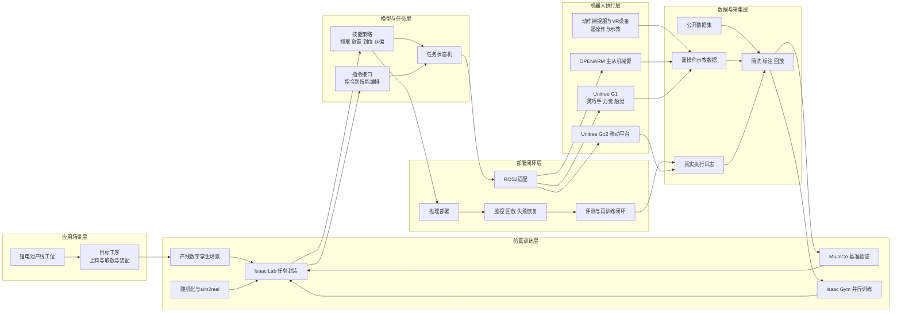
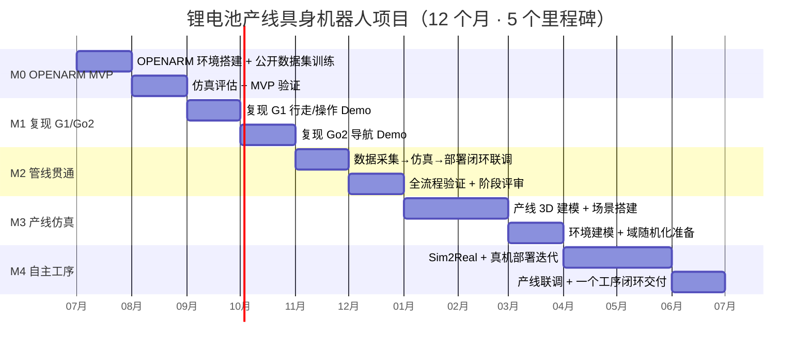

# 锂电池产线具身机器人部署规划

> 采用“前6个月打通数据-仿真-部署闭环、后6个月聚焦产线单工序落地”的路径，以 OPENARM 抓取任务作为MVP切入点，最终实现机器人G1 / GO2自主完成一个工序。

## 背景与动机

### 硬件基础

- Unitree G1（含灵巧手、六维力传感器、触觉）
- Unitree Go2（移动平台）
- OPENARM 主从机械臂（遥操作与抓取）
- 动作捕捉服（遥操作/示教数据采集）
- VR 设备（沉浸式遥操作/示教与人机交互）

### 业务场景与问题

- 场景：锂电池装备生产线（叠片机、卷绕机等工位）
- 需求：替代工人在不同工序中进行装配与上料/取放流程
- 难点：工位复杂、对象多样、接触丰富、误差与扰动大，传统固定工装自动化柔性不足
- 策略：先用公开数据与公开仿真环境快速复现能力与打通闭环，再投入产线数字孪生与单工序落地，避免多线并行导致失控

## 核心内容

### 目标

1. MVP目标（0-6个月）：基于 OPENARM、G1/Go2，利用公开数据/环境，完成“根据指令走到某处抓取指定物体”的可演示闭环验证，并打通采集-仿真-部署流程。
2. 产线目标（7-12个月）：搭建一个目标工序的数字孪生仿真场景，训练并部署策略，实现真实工位自主完成该工序。

### 整体系统框图

### 技术路线（训练与部署）

- 仿真与训练：MuJoCo（快速验证，碰撞检测）+ Isaac Gym（并行训练，原型验证）+ Isaac Lab（任务封装与产线场景主平台）
- 数据：公开数据集/公开仿真环境优先；补充遥操作示教数据与真实执行日志用于校正与后训练
- 技能策略: 抓取、放置、到位、纠偏
- 部署闭环：推理部署 + 再训练迭代

### 甘特图

### 阶段计划与里程碑（12个月，每两个月一个里程碑）

| 时间段    | 里程碑                  | 关键工作                                                             | 验收产出                                 |
| --------- | ----------------------- | -------------------------------------------------------------------- | ---------------------------------------- |
| 1-2个月   | M0 抓取MVP基线          | 环境与接口对齐、OPENARM仿真适配、公开数据/环境复现功能、baseline跑通 | 仿真和真机抓取baseline可演示；           |
| 3-4个月   | M1 数据闭环与多平台复现 | 遥操作采集、清洗回放、训练评测闭环；G1/Go2/OPENARM基础能力复现       | 采集-训练-评测可重复；三类机器人基础Demo |
| 5-6个月   | M2 真机部署与阶段1验收  | 真机部署、sim2real初步                                               | 真机端到端闭环                           |
| 7-8个月   | M3 工序建模与数字孪生   | 工序拆解、工位/对象建模、Isaac Lab场景搭建、奖励/随机化/失败判定     | 数字孪生训练环境可跑通                   |
| 9-10个月  | M4 策略训练与真实适配   | 单工序全流程训练与回归评测；标定/坐标对齐                            | 仿真全流程成功；真实工位初步闭环         |
| 11-12个月 | M5 现场联调与最终验收   | 上下游协同、节拍与稳定性优化、连续运行测试、文档/模型/部署手册       | 连续稳定演示；自主完成一个工序           |

### 阶段1（0-6个月）：MVP与流程打通

#### 目标

- 用 OPENARM 训练并部署抓取任务，形成可重复演示的MVP
- 打通数据采集、仿真训练、部署验证闭环
- 复现 G1/Go2/OPENARM 的基础能力与功能，统一工程化框架（日志、评测）

#### MVP验收建议（可量化）

- 仿真：指定物体抓取成功率 ≥ 80%，可批量评测
- 真机：指定物体抓取成功率 ≥ 70%，可连续演示 ≥ 20次
- 闭环：支持“采集→清洗→训练→部署→回放”的完整流水线，xu yao z运行一致性

### 阶段2（7-12个月）：产线工序落地

#### 工序选择原则

- 优先“上料/治具取放”等可定义成功判据的工序（需要后续去产线实地调查）
- 只选一个工序作为12个月主验收对象

#### 目标

- 完成目标工位数字孪生与任务建模
- 完成仿真全流程训练与sim2real适配
- 完成现场部署与连续运行验证，实现自主完成一个工序

#### 最终验收建议（可量化）

- 真实工位单工序成功率 ≥ 85%，连续运行 ≥ 2小时无重大故障

### 团队分工（2人）

- 仿真/算法负责人：陈斯斯：任务环境、训练框架、策略训练、sim2real、评测体系
- 系统/部署负责人：杨海宾：ROS2适配、遥操作采集、推理部署、监控回放、现场联调

### 风险与对策

- Sim2Real差距大：尽早引入标定、domain randomization
- 范围失控：只交付一个工序、一个主机器人形态；其他平台以复现与预研为主
- 数据不足：前6个月优先公开数据与公开环境，真实数据用于校正与提升鲁棒性，研究世界模型，合成数据，场景，

### 交付物清单

- 可运行的训练与部署工程（含评测/回放工具）
- OPENARM 抓取MVP（仿真+真机演示）
- 目标工序数字孪生场景资产与训练环境
- 单工序自主执行Demo（真实工位）
- 文档：任务定义、接口说明、部署手册

## 相关

- [[锂电池产线具身机器人部署规划（PPT 3页版）]]
- [[OpenARM]]
- [[Isaac Lab]]
- [[LeRobot]]
- [[遥操作（Teleoperation）]]
- [[Wiki 目录]]
