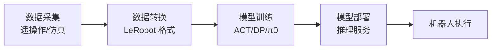

# LeRobot

> Hugging Face 开源的机器人学习框架，提供数据收集、模型训练和部署的完整工具链。

## 是什么

LeRobot 是一个端到端的机器人学习平台，支持：
- 标准化的数据格式和采集流程
- 多种策略模型（ACT、Diffusion Policy、π0 等）
- 与仿真环境（Isaac Lab）和真实机器人的集成

## 为什么重要

- **降低门槛**：提供开箱即用的训练流水线，无需从零搭建
- **数据标准化**：统一的数据格式便于共享和复用
- **模型生态**：集成多种 SOTA 策略模型，支持微调

## 工作原理

## 核心组件

| 组件 | 功能 |
|------|------|
| 数据格式 | HDF5 → LeRobot 格式转换 |
| 策略模型 | ACT、Diffusion Policy、π0、GR00T、Pi0.5 |
| 训练框架 | PyTorch + WandB |
| 部署工具 | 推理服务端点 + 客户端控制 |
| EnvHub | 一行代码从 Hub 加载仿真环境，支持遥操作 |

## 与相邻概念的区别

- **Isaac Lab**：仿真环境，LeRobot 可与其集成进行数据收集和训练
- **GR00T**：NVIDIA 的策略模型，可通过 LeRobot 框架进行微调
- **ACT**：策略算法，LeRobot 框架支持的模型之一

## 相关

- [[Isaac Lab]]
- [[GR00T N1.5]]
- [[ACT（动作分块变换器）]]
- [[遥操作（Teleoperation）]]
- [[资料摘要：Isaac Lab 训练 LeRobot SO-101 机械臂]]
- [[资料摘要：SOArm101 仿真与机械臂策略训练]]
- [[Wiki 目录]]
