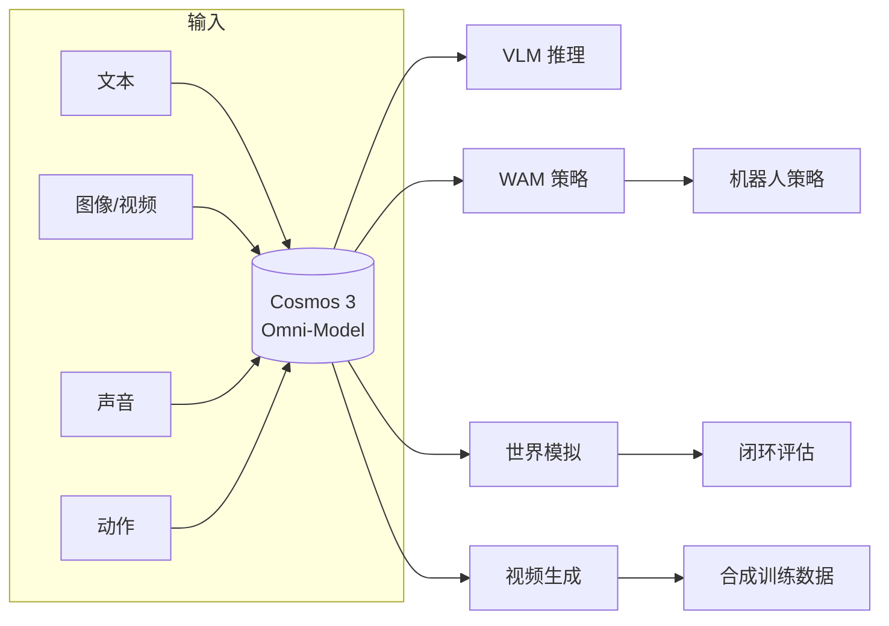

# NVIDIA Cosmos

> NVIDIA 推出的世界基础模型平台，首个具备原生推理、世界模拟和动作生成的全能模型（Omni-Model），用于加速物理 AI —— 机器人、自动驾驶和工业视觉系统的开发。

## 是什么

Cosmos 3 是一个基于 Mixture-of-Transformers 架构的**世界基础模型**，同一模型同时具备四种能力：
1. **视觉语言模型（VLM）**：理解复杂场景中的物体、交互和意图
2. **世界动作模型（WAM）**：作为机器人策略学习的骨干网络
3. **世界模拟器**：可控的物理世界预测与评估
4. **视频生成器**：从文本/图像/视频/声音/动作生成合成数据

## 为什么重要

- **"世界模型"理念落地**：不只做感知或生成，而是统一了理解、模拟和行动
- **机器人策略学习的加速器**：作为 WAM 骨干，降低策略训练的数据需求
- **与 Isaac Lab 互补**：Isaac 做仿真基础设施，Cosmos 做智能推理和生成
- **开放生态**：数据处理（Curator）、评估（Evaluator）、训练框架全部开放

## 工作原理

### 四大核心能力

| 能力 | 模式 | 应用场景 |
|------|------|---------|
| **视觉 AI 推理** | VLM | 质检、安防、物流、自动驾驶的实时检测和密集字幕 |
| **策略模型构建** | WAM 骨干 | 在专用场景数据上后训练，适应特定任务 |
| **世界模拟** | 模拟器 | 闭环预测和评估多种方法，无风险大规模迭代 |
| **合成数据生成** | 视频生成 | 从多模态输入生成无限可能的未来情景 |

### 能力关系图

### 开放工具链

| 工具 | 功能 |
|------|------|
| Cosmos Curator | 传感器数据筛选、注释、去重 |
| Cosmos Evaluator | 大规模成品视频审核和评分 |
| 后训练框架 | 快速构建和部署世界模型 |
| Agent Skills | 将编程智能体转为合成数据专家 |

## 历史与演进

- **2025.01**：NVIDIA Cosmos 首次发布（CES 2025）
- **2026.06**：Cosmos 3 发布——首个 Omni-Model，集成推理+模拟+生成
- 针对 NVIDIA Blackwell GB200 / RTX PRO 6000 优化

## 与 Genesis 的对比

| | NVIDIA Cosmos | Genesis |
|---|:------------:|:-------:|
| 定位 | 世界基础模型平台 | 物理引擎+生成式框架 |
| 核心能力 | 智能推理+数据生成 | 物理仿真+可微分模拟 |
| 硬件依赖 | NVIDIA GPU（Blackwell 优化） | 任意硬件 |
| 开放程度 | 开放模型+工具链 | 开源引擎 |
| 互补关系 | 高层智能 | 底层物理 |

## 常见误解

1. **"Cosmos 只是一个视频生成器"**：视频生成只是其能力之一，核心是 WAM 和世界模拟
2. **"Cosmos 和 Isaac 是竞争关系"**：互补——Isaac 做仿真环境，Cosmos 做智能推理和生成

## 相关

- [[Isaac Lab]]
- [[Genesis]]
- [[VLA（视觉-语言-动作模型）]]
- [[资料摘要：NVIDIA Cosmos 世界模型]]
- [[资料摘要：Cosmos 3 Omnimodal World Models]]
- [[Wiki 目录]]
