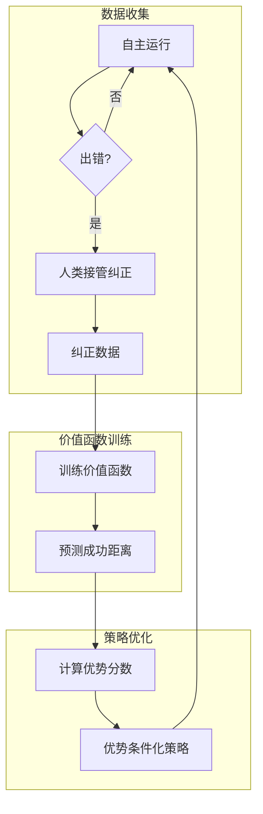

# RECAP（优势条件化强化学习）

> Physical Intelligence 提出的真实世界强化学习范式，通过价值函数和优势条件化策略实现机器人持续学习。

## 是什么

RECAP（Reinforcement Learning with Experience and Corrections via Advantage-Conditioned Policies）是一种统一的强化学习框架，让机器人能够：
1. 从人类纠正中学习
2. 通过自主练习提升
3. 超越原始示范数据的表现

## 为什么重要

- **解决累积错误**：模仿学习的核心痛点
- **真实世界学习**：无需仿真，直接在真机上训练
- **持续改进**：数据越多，策略越强

## 工作原理



### 三步流程

| 步骤 | 内容 | 作用 |
|------|------|------|
| 数据收集 | 自主运行 + 人工干预 | 获取成功/失败经验 |
| 价值函数训练 | 预测完成任务剩余步数 | 判断动作好坏 |
| 优势条件化策略 | 优势分数作为额外输入 | 学习好动作，避开坏动作 |

### 优势分数

```
优势 = V(s') - V(s)
```
- 正优势：动作让状态更接近成功 → 学习
- 负优势：动作让状态远离成功 → 避免

## 与[[模仿学习（Imitation Learning）]]的对比

| 特性 | 模仿学习 | RECAP |
|------|----------|-------|
| 数据来源 | 仅示范 | 示范 + 自主 + 纠正 |
| 错误处理 | 无 | 人类纠正 + 学习恢复 |
| 性能上限 | 不超过示范 | 可超越示范 |
| 累积错误 | 严重 | 通过 RL 缓解 |

## 相关

- [[VLA（视觉-语言-动作模型）]]
- [[PPO（近端策略优化）]]
- [[RLHF（基于人类反馈的强化学习）]]
- [[资料摘要：π*0.6 真实世界强化学习]]
- [[Wiki 目录]]
