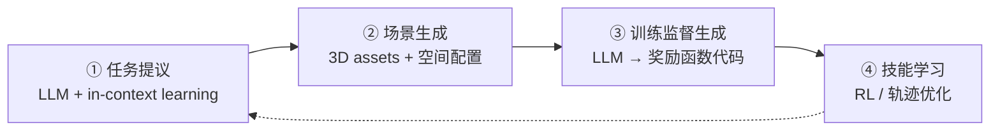

# RoboGen

> 一种通过生成式模拟（Generative Simulation）自动学习多种机器人技能的机器人代理，核心思想是"提议-生成-学习"（propose-generate-learn）循环——自动生成多样化的任务、场景和训练监督，最小化人工干预。

## 是什么

RoboGen 是一个全自动的机器人技能学习流水线，包含四个阶段：

1. **任务提议**：LLM 基于物体语义自主提出新任务
2. **场景生成**：3D assets 按有意义的空间配置摆放
3. **训练监督生成**：LLM 将抽象任务转化为代码形式的奖励函数
4. **技能学习**：RL 或轨迹优化 → 策略/轨迹

## 为什么重要

- **数据瓶颈是机器人最大挑战**：遥操作数据难以 scale，RoboGen 提供了一条**自动生成无限示教数据**的路径
- **全自动化**：从任务定义到策略学习，零人工干预
- **与 Genesis 的关系**：RoboGen 是 Genesis 生成式能力的最重要应用示例

## 工作原理

### 四阶段流水线

**① 任务提议**：从物体数据集中采样物体，基于其语义（如"微波炉→加热食物"）或 affordance 提出任务

**② 场景生成**：
- text-to-3D / image-to-3D 生成 3D assets
- 按空间逻辑摆放（厨房、客厅等）
- 添加干扰项增加视觉多样性
- 新方向：3D GS 用于 Real2Sim 场景生成

**③ 训练监督生成**：LLM 编写奖励函数代码，将抽象任务转化为可优化的数值目标

**④ 技能学习**：
- 复杂任务 → RL 策略（闭环控制）
- 简单任务 → 路径规划轨迹（开环）
- 多条轨迹 → 模仿学习蒸馏为通用策略

### 策略 vs 轨迹

| 特点 | 策略 (Policy) | 轨迹 (Trajectory) |
|------|:------------:|:-----------------:|
| 控制方式 | 闭环（根据状态调整） | 开环（预定义） |
| 适合任务 | 复杂/动态 | 简单/静态 |
| 学习方式 | RL 训练 | 路径规划 |
| 可组合性 | 可蒸馏为通用策略 | 可作为演示数据 |

## 历史与演进

- **2023**：RoboGen 发表于 CoRL 2023
- **底层依赖**：Genesis 物理引擎（可微分模拟 + 场景生成）
- **系列工作**：PlastineLab → Roboninja → FluidLab → SoftZoo → RoboGen 逐步演进

## 与遥操作的关系

遥操作采集示教数据是目前主流方法，但 RoboGen 代表另一条路线——**仿真中自动生成**。两者互补：
- 遥操作：数据真实但难以 scale
- RoboGen：数据可无限生成但需解决 Sim2Real

## 相关

- [[Genesis]]
- [[可微分物理引擎（Differentiable Physics）]]
- [[遥操作（Teleoperation）]]
- [[Isaac Lab]]
- [[资料摘要：RoboGen与可微分模拟]]
- [[资料摘要：Genesis 物理引擎]]
- [[Wiki 目录]]
