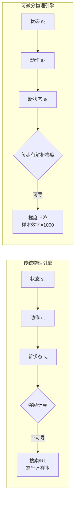

# 可微分物理引擎（Differentiable Physics）

> 一种可以对其输入参数进行微分的物理模拟器，核心优势是能用梯度下降替代搜索/强化学习来优化机器人技能学习，效率提升数个数量级。

## 是什么

可微分物理引擎在传统物理引擎的基础上，增加了**可微分性**——仿真过程中每一步状态转换都有解析梯度。

- **传统物理引擎**：输入→计算→输出（不可导）→ 只能搜索或 RL
- **可微分物理引擎**：输入→计算→输出（每步可导）→ 梯度下降优化

## 为什么重要

- **效率革命**：Trajectory Optimization 比 RL 高效多个数量级
- **柔体操作的关键**：处理衣物、流体等粒子系统时，传统 RL 的状态空间巨大，可微分是必需
- **数据生成加速**：快速生成大量高质量示教数据
- **Genesis 的核心差异化**：这是 Genesis 区别于所有传统仿真器的根本特性

## 工作原理

### 传统 vs 可微分对比

### 数学直觉

给定一个物理系统，每一步的状态转移可以表示为：`s_{t+1} = f(s_t, a_t)`

- **不可导**：无法计算 `∂f/∂a`，只能暴力搜索哪个动作好
- **可导**：可以精确计算 `∂f/∂a`，用链式法则反向传播优化动作

### 何时需要可微分

| 场景 | RL 是否够用 | 可微分是否必要 |
|------|:-----------:|:--------------:|
| 刚体操作（抓取方块） | 够用，但样本多 | 提升效率 |
| 柔体操作（折衣服） | 状态空间爆炸 | **必需** |
| 流体操作（倒水） | 几乎不可能 | **必需** |
| 多关节运动（跑酷） | 够用 | 加速优化 |

## 历史与演进

- **~2020**：传统物理引擎（Bullet/ODE/MuJoCo）全部不可微
- **2021**：PlastineLab（淦创×胡渊明 Taichi）——可微分模拟在机器人学习中的开创性工作
- **2021-2023**：FluidLab、SoftZoo、ThinSellLab 系列工作验证可微分在柔体/流体操作中的必要性
- **2024.12**：Genesis 发布——首个大规模开源可微分物理引擎

## 常见误解

1. **"可微分会取代 RL"**：不会——两者互补。RL 处理非凸全局搜索，可微分做局部精细优化
2. **"梯度信息总是好的"**：不一定——接触力的梯度可能导致不连续的优化景观，引入噪声
3. **"可微分引擎更慢"**：恰恰相反——Genesis 比普通引擎快 10-80 倍

## 与相邻概念的区别

- **RL（强化学习）**：通过奖励信号搜索最优策略，样本效率低但全局搜索能力强
- **Trajectory Optimization**：通过梯度优化轨迹，样本效率高但需要可微分环境
- **MPC（模型预测控制）**：滚动优化，可结合可微分模型做更精确的预测

## 相关

- [[Genesis]]
- [[RoboGen]]
- [[Isaac Lab]]
- [[PPO（近端策略优化）]]
- [[资料摘要：RoboGen与可微分模拟]]
- [[Wiki 目录]]
