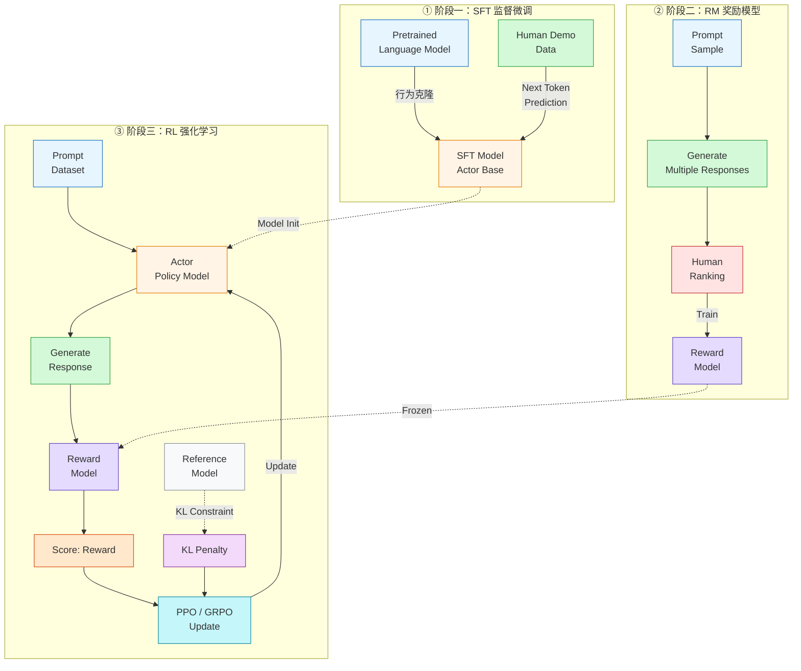

# RLHF 三阶段流水线

> RLHF（基于人类反馈的强化学习）将人类偏好编码为可优化信号的完整流程，从行为克隆到偏好建模再到策略优化。

## 流程总览

### 各阶段说明

- **阶段一（SFT）**：预训练模型通过行为克隆学习人工标注的高质量回答，获得基础对话能力
- **阶段二（RM）**：训练一个独立的 Reward Model 用于编码人类偏好，对同一 prompt 的多个回答进行排序打分
- **阶段三（RL）**：使用 PPO/GRPO 等算法以 RM 的评分为奖励信号优化策略，同时用 KL 散度约束防止偏离参考模型过远

## 算法对比

```mermaid
graph TB
    subgraph legend["图例"]
        L1["Model: Trainable"]
        L2["Model: Frozen"]
        L3["Data / Signal"]
    end

    subgraph ppo["PPO（4 模型）"]
        P_A["Actor"]
        P_RM["Reward<br/>Model"]
        P_C["Critic"]
        P_Ref["Reference<br/>Model"]
        P_A -->|"Response"| P_RM
        P_RM -->|"Score"| P_C
        P_C -->|"Advantage"| P_A
        P_Ref -.->|"KL"| P_A
    end

    subgraph dpo["DPO（2 模型）"]
        D_A["Actor"]
        D_Ref["Reference<br/>Model"]
        D_Data["Preference<br/>Pair Data"]
        D_Data -->|"Chosen vs<br/>Rejected"| D_A
        D_Ref -.->|"KL"| D_A
    end

    subgraph grpo["GRPO（3 模型）"]
        G_A["Actor"]
        G_RM["Reward<br/>Model"]
        G_Ref["Reference<br/>Model"]
        G_Group["Group<br/>Sampling x G"]
        G_A -->|"G Responses"| G_Group
        G_Group -->|"Score"| G_RM
        G_RM -->|"Group Norm"| G_A
        G_Ref -.->|"KL"| G_A
    end

    style P_A fill:#fff4e6,stroke:#e67700
    style P_RM fill:#e5dbff,stroke:#5f3dc4
    style P_C fill:#ffe3e3,stroke:#c92a2a
    style P_Ref fill:#f8f9fa,stroke:#868e96
    style D_A fill:#fff4e6,stroke:#e67700
    style D_Ref fill:#f8f9fa,stroke:#868e96
    style D_Data fill:#d3f9d8,stroke:#2f9e44
    style G_A fill:#fff4e6,stroke:#e67700
    style G_RM fill:#e5dbff,stroke:#5f3dc4
    style G_Ref fill:#f8f9fa,stroke:#868e96
    style G_Group fill:#c5f6fa,stroke:#0c8599
    style L1 fill:#fff4e6,stroke:#e67700
    style L2 fill:#f8f9fa,stroke:#868e96
    style L3 fill:#d3f9d8,stroke:#2f9e44
```

## 关键洞察

- PPO 在数据效率上最优（在线探索 + Critic 精确指导），但硬件成本最高
- DPO 最轻量，但对偏好数据质量和分布一致性要求极高
- GRPO 是折中方案：去掉了 Critic，保留了在线探索能力，适合可验证任务
- 从 PPO → DPO → GRPO 的演进本质上是在"成本-效率-质量"三角中寻找新的平衡点

## 相关

- [[RLHF（基于人类反馈的强化学习）]]
- [[PPO（近端策略优化）]]
- [[GRPO（组相对策略优化）]]
- [[DPO（直接偏好优化）]]
- [[Wiki 目录]]
