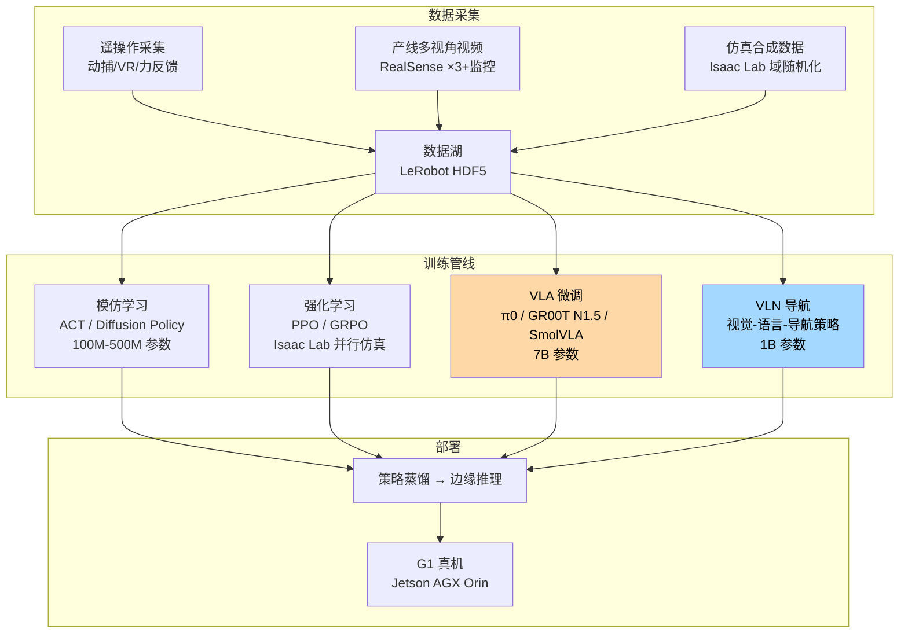
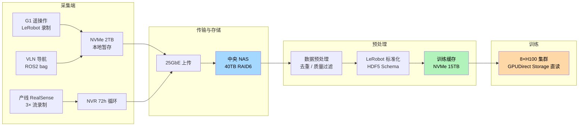

# 锂电池产线具身机器人算力建设规划

> **面向锂电池装备产线的 VLA + VLN 算力基础设施方案**。基于 Unitree G1 Edu U6-ZL 旗舰版 D 双足人形机器人（因时 RH56DFTP 五指灵巧手 ×2、Intel RealSense D435i 深度相机、LIVOX-MID360 3D 激光雷达），规划支撑 VLA（视觉-语言-动作模型）微调、VLN（视觉语言导航）训练及 Isaac Lab 强化学习所需的 GPU 算力集群，包含数据体量估算、NVLink 通信需求分析、服务器选型建议及分阶段预算 ROI。

---

## 第 1 页：业务背景与算力需求总览

### 1.1 业务场景

锂电池装备生产线涉及多道离散工序——极片分切、叠片、入壳、注液、化成、分容检测、模组组装等。当前产线依赖人工完成工件上下料、外观质检、异常处置和工位间物料流转。目标是**用 G1 双足人形机器人逐步替代人工**，实现：协同 | 通用操作 + 产线级自主决策 | **VLA** + VLN 联合 |

### 1.2 硬件资产

| 硬件 | 规格 | 训练用途 |
|------|------|------|
| **Unitree G1 Edu U6-ZL** | 29 自由度双足人形 | 全身运动控制 + 移动操作 |
| **因时 RH56DFTP** ×2 | 五指灵巧手，单手 17 触觉传感器 | 灵巧操作、力控策略 |
| **Intel RealSense D435i** | RGB-D 深度相机（1280×720 @30fps） | 视觉感知、VLN 导航 |
| **LIVOX-MID360** | 360° 3D 激光雷达（40m 测距） | SLAM、避障、全局定位 |

### 1.3 训练技术栈全景



### 1.4 训练方向与算力量级

| 训练方向 | 模型规模 | 单次训练算力需求 | 训练周期 | 难度 | 优先级 |
|:---|:---:|:---|:---:|:---:|:---:|
| **模仿学习（ACT/DP）** | 100M-500M | 1-2× RTX 4090（24GB）| 数小时~1 天 | ★★ | P0 |
| **RL 运动控制（PPO）** | 10M-50M | | 0.5-2 天 | ★★★ | P0 |
| **RL 灵巧操作（PPO+蒸馏）** | 50M-200M | 4-8× H100（80GB）| 2-5 天 | ★★★★ | P1 |
| **VLN 导航策略** | 100M-1B | 2-4× H100（80GB）| 1-3 天 | ★★★ | P0 |
| **VLA LoRA 微调** | 1B-3B | 1-2× H100（80GB）| 0.5-1 天 | ★★★ | P1 |
| **VLA 全量微调（π0 风格）** | 3B-7B | 4-8× H100（80GB）NVLink | 3-7 天 | ★★★★ | P1 |

> **核心结论**：VLA 7B 全量微调是本方案的算力天花板。首选 **8×H100 SXM5 80GB + NVSwitch**，单步训练在 FP8 下可达亚秒级，VLA 全量微调 3 天完成一个迭代周期。

### 1.5 为什么需要这么多算力？

| 原因 | 技术细节 | 通俗类比 |
|------|------|------|
| **VLA 是三合一巨型网络** | 视觉编码器（SigLIP/ViT，~300M）+ 语言解码器（Gemma/Phi-3，~2-3B）+ 动作专家（Flow Matching/Diffusion Head），三模块联合微调时激活内存叠加。7B 模型 FP16 仅权重就占 14GB，加上梯度（14GB）和 Adam 优化器状态（28GB），单卡至少需要 56GB+ | 等于在 GPU 上同时跑 **CLIP + GPT + Stable Diffusion**，三者还要实时互相对话 |
| **视觉 token 是文本的 1000 倍** | VLA 每步推理需处理 1-3 帧 720p 图像。SigLIP 将每帧切成 ~2,500 个 visual token，3 帧 = 7,500 token。对比：一句语言指令约 10-20 token。视觉部分占据了 95%+ 的计算量 | 语言模型吃一句话（20 个字），VLA 每步吃三张高清照片（相当于 7500 个字的信息量） |
| **RL 需要数千并行仿真** | Isaac Lab 中单个 G1 仿真环境占用 2-5GB 显存。PPO 需要 4,096+ 并行环境维持样本多样性，仅环境渲染就需要 **8-20TB 累积显存**，必须多 GPU 分摊 | 同时运行 4096 个 3D 游戏，每个都是独立物理世界 |
| **动作是连续高维空间** | G1 有 29 个关节 + 10 指关节 + 灵巧手位置控制。Flow Matching 在 39+ 维连续空间中学习向量场，比语言模型的离散 token 预测复杂 10 倍以上 | 语言模型学"下一个词"（5 万选 1），VLA 学"下一个关节角度"（无限连续空间中的精确 39 维向量） |
| **多模态同步 ≠ 各自独立训练** | VLA 的关键难点不是各模块的绝对大小，而是跨模态注意力（cross-attention）——视觉 token 要 attend 到语言 token，语言 token 要 attend 到动作 token。这种跨模态计算量随 token 数平方增长 | 不是分别训练三个模型然后拼接，而是一个模型内三种信息实时互相对齐 |

---

## 第 2 页：训练数据体量与管线

### 2.1 数据全景表

```
┌──────────────────────────────────────────────────────┐
│               VLA + VLN 训练数据全景                    │
├──────────┬────────────┬───────────┬──────────────────┤
│  数据类型 │   采集方式   │  单工序量  │   10 工序总量     │
├──────────┼────────────┼───────────┼──────────────────┤
│ 遥操作演示│ G1 动捕+VR  │ 200条×3min│ 2,000 条轨迹      │
│ (主数据源)│ LeRobot录制 │ ≈500GB    │ ≈5TB             │
├──────────┼────────────┼───────────┼──────────────────┤
│ 多视角视频│ 3× D435i   │ 50h/工序  │ 500h             │
│ (VLA训练) │ + 工位监控  │ ≈150GB    │ ≈1.5TB           │
├──────────┼────────────┼───────────┼──────────────────┤
│ VLN 导航  │ MID360 +   │ 20 条路径 │ 200 条导航路径    │
│ 轨迹      │ D435i SLAM │ ×3 次往返 │ ≈500GB           │
├──────────┼────────────┼───────────┼──────────────────┤
│ 触觉数据  │ RH56DFTP   │ 200条×    │ 2,000 条          │
│          │ 34 传感器   │ 34×300Hz  │ ≈200GB           │
├──────────┼────────────┼───────────┼──────────────────┤
│ 语言指令  │ 工序 SOP   │ 50-100条  │ 500-1,000 条      │
│ 标注      │ 自然语言    │ /工序     │ ≈1GB（文本）      │
├──────────┼────────────┼───────────┼──────────────────┤
│ 仿真数据  │ Isaac Lab  │ 域随机化  │ 10-30TB           │
│          │ 并行仿真    │ 每步渲染  │ （回放缓冲区/循环） │
├──────────┼────────────┼───────────┼──────────────────┤
│ 产线巡检  │ 日常运行    │ 持续累积  │ 0.5TB/月（增量）   │
│ 回流数据  │            │           │                  │
├──────────┼────────────┼───────────┼──────────────────┤
│ 合计（首年）│           │           │ ≈20-40TB         │
│ （持久存储）│           │           │ （不含循环缓冲区）  │
└──────────┴────────────┴───────────┴──────────────────┘
```

### 2.2 各模块数据详解

#### A. VLA 微调数据（核心资产）

参照 π0 和 GR00T N1.5 的训练范式，VLA 数据需要**多模态配对**：

| 数据组件 | 说明 | 格式 |
|------|------|------|
| **视觉观测** | 3 视角 RGB（D435i ×3），1280×720 → 训练时下采样至 256×256 | H.265 压缩帧 |
| **语言指令** | 自然语言任务描述 + 子步骤拆解，如"拿起蓝色电芯，放入 A3 工位检测槽，顺时针旋转 90°" | JSON text |
| **动作序列** | 29 关节角度 + 10 指关节 + 灵巧手开合度，30-50Hz | float32 数组 |
| **触觉反馈** | 单手 17 传感器 ×2，300Hz | float32 数组 |
| **任务元数据** | 成功率标记、执行速度、异常标签 | JSON metadata |

单条轨迹（3 分钟，30Hz）≈ **5,400 步 × 多模态数据 ≈ 500MB-1.5GB**

| 工序复杂度 | 轨迹数需求 | 单条大小 | 小计 |
|:---|:---:|:---:|:---:|
| 简单（抓取-放置） | 100 条 | 500MB | **50GB** |
| 中等（多步操作） | 150 条 | 800MB | **120GB** |
| 复杂（精细装配） | 200 条 | 1.5GB | **300GB** |
| **10 工序总 VLA 数据** | | | **≈3-5TB** |

#### B. VLN 导航数据

| 参数 | 值 | 说明 |
|------|-----|------|
| 工位间路径数 | 15-30 条 | 覆盖产线全部工位对 |
| 每条路径采集次数 | 3-5 次 | 不同光照/障碍物条件 |
| 单次导航数据 | LiDAR 点云 + RGB-D + 里程计 + 语言目标 | ROS2 bag 格式 |
| 单次导航时长 | 2-5 分钟 | 含避障和停靠 |
| 单次数据大小 | 2-5GB | 点云是主要开销 |
| **VLN 数据总量** | **≈300-800GB** | 100 次导航记录 |

#### C. RL 仿真数据

| 参数 | 值 | 说明 |
|------|-----|------|
| 并行环境数 | 2,048-8,192 | Isaac Lab GPU 并行（H100 可推更高并发） |
| 总环境步数/任务 | 50M-500M | PPO 收敛所需量级 |
| 仿真分辨率 | 128×128 至 320×240 | 域随机化：材质/光照/动力学 |
| 回放缓冲区 | 1-5TB（循环） | RAM Disk 或 NVMe |
| 持久存储 | 仅保留 checkpoint | 每任务 ~10-50GB |

### 2.3 数据管线架构



---

## 第 3 页：服务器配置与 NVLink 详解

### 3.1 为什么首选 H100？

在 VLA + VLN 场景下，H100 相比 A100 不是"锦上添花"，而是有**实质性训练效率代差**：

| 维度 | H100 SXM5 80GB | A100 SXM4 80GB | H100 优势 |
|------|:---:|:---:|:---|
| **FP8 Tensor Core** | ✅ 1,979 TFLOPS | ❌ 不支持 | **A100 完全无法使用 FP8**，H100 在 VLA 训练中可实现 2× 吞吐 |
| **FP16 Tensor Core** | 989 TFLOPS | 312 TFLOPS | **3.2×** 算力 |
| **显存带宽** | 3.35 TB/s | 2.0 TB/s | **1.7×**，视觉 token 预处理是带宽密集型 |
| **NVLink 带宽** | 900 GB/s | 600 GB/s | **1.5×**，跨 GPU 通信更快 |
| **Transformer Engine** | ✅ 硬件加速 | ❌ | 自动混合精度（FP8/FP16），训练提速 30-50% |
| **显存** | 80GB HBM3 | 80GB HBM2e | 同容量，但 HBM3 功耗更低 |
| **最大 TDP** | 700W | 400W | 功耗更高但能效比更优（每瓦算力 1.4×） |
| **单价** | ~25-30 万 | ~12-15 万 | 约 2× 价格，但 FP8 场景下性价比相当 |

#### H100 对 VLA 训练的具体加速

```
VLA 7B 全量微调（100 亿 token，4 GPU）：

A100 SXM4（FP16）：
  单步耗时 ≈ 0.8-1.2s
  总训练时间 ≈ 5-8 天
  GPU 利用率 ≈ 82-90%

H100 SXM5（FP8 + Transformer Engine）：
  单步耗时 ≈ 0.25-0.4s
  总训练时间 ≈ 2-3 天
  GPU 利用率 ≈ 88-95%

结论：H100 将 VLA 微调周期从 1 周压缩到 2-3 天，
      每月可多迭代 1-2 轮，直接加速算法验证节奏。
```

### 3.2 NVLink

```
多 GPU 通信方式对比（以 8 GPU AllReduce 为例）

PCIe 4.0 x16 ×8（无 NVLink）：
  有效 AllReduce 带宽 ≈ 10-15 GB/s/GPU
  VLA 7B ZeRO-3 通信占比 ≈ 35-50%
  GPU 有效利用率 ≈ 50-65%

NVLink Bridge（4 GPU，900GB/s 对间）：
  有效 AllReduce 带宽 ≈ 120-180 GB/s/GPU
  VLA 7B TP=2 + ZeRO-2 通信占比 ≈ 10-18%
  GPU 有效利用率 ≈ 82-90%

NVSwitch（8 GPU，900GB/s 全互联）：
  有效 AllReduce 带宽 ≈ 250-350 GB/s/GPU
  VLA 7B TP=4 + ZeRO-2 通信占比 ≈ 3-8%
  GPU 有效利用率 ≈ 92-97%
```

| 场景 | 无 NVLink（PCIe Only） | 有 NVSwitch（8×H100） | 差异 |
|------|:---:|:---:|:---:|
| VLA 7B 全量微调 单步耗时 | ~2-4s | ~0.2-0.4s | **5-10× 加速** |
| 8 GPU 扩展效率 | ~55%（4 GPU 后递减） | ~95%（近乎线性） | 8 GPU 等效 7.6 vs 4.4 |
| 是否适合高频迭代 | 否（训练太慢） | **是** | |

#### 技术原因：

1. **张量并行（Tensor Parallelism）是 VLA 最优并行策略**：VLA 的视觉 encoder 输出 token 数量巨大（每帧 2,500+），跨模态 cross-attention 需要在 GPU 间频繁传递 KV cache。TP 将每层 QKV 计算切分到多 GPU，每层结束做一次 AllReduce——NVSwitch 的 900GB/s 使这笔开销 <5%。
2. **序列并行（Sequence Parallelism）**：视频帧序列（3 帧历史 + 1 帧当前）产生 ~10,000 visual token，单卡放不下完整激活。沿序列维度切分后，每次 attention 需要在 GPU 间传递 KV cache，NVLink 是唯一可接受的方案。
3. **FP8 分布式训练**：H100 的 Transformer Engine 在 FP8 精度下做 TP 时，通信量减半但频次不变——更依赖低延迟互联，NVSwitch 的优势在 FP8 下进一步放大。

> **结论**：VLA 7B 全量微调在 PCIe 下**理论可训但实际不可接受**（迭代周期从 3 天变成 3 周）。NVSwitch 是实现"天级迭代"的前提，是**实际意义上的刚性需求**。

### 3.3 推荐服务器配置

#### ⭐ 方案 A：H100 NVSwitch 全互联方案（首选）

| 组件 | 型号/规格 | 数量 | 单价（万元） | 小计（万元） |
|------|------|:---:|:---:|:---:|
| **GPU 服务器** | NVIDIA DGX H100（8×H100 SXM5 80GB, NVSwitch 全互联） | 1 | 250-300 | 250-300 |
| **或自建等效服务器** | Supermicro SYS-821GE-TNHR + 8×H100 SXM5 + NVSwitch 基板 | 1 | 200-260 | 200-260 |
| **仿真/推理节点** | RTX 6000 Ada 48GB（独立于训练集群，仿真开发不占用 H100） | 1 | 5-7 | 5-7 |
| **高性能存储** | 15TB NVMe 全闪阵列（RAID0, GPUDirect Storage 兼容） | 1 | 5-8 | 5-8 |
| **温冷存储** | 40TB NAS（6×10TB HDD RAID6, 25GbE） | 1 | 3-5 | 3-5 |
| **网络** | NVIDIA MQM9700 InfiniBand NDR400 交换机（或 100GbE RoCE） | 1 | 12-18 | 12-18 |
| **机柜/电力/散热** | 42U 机柜 + 双路 32A + 行级精密空调 | 1 | 8-12 | 8-12 |
| | | | **合计** | **233-310** |

> **8×H100 SXM5 + NVSwitch**：640GB 总显存，900GB/s 全互联。可同时支撑 VLA 7B 全量微调（TP=4）+ Isaac Lab 2,048+ 环境并行仿真 + VLN 训练。FP8 下 VLA 训练 2-3 天/迭代。

#### 备选方案 A-Compact：4×H100 NVLink Bridge（预算敏感型首选）

若 8×H100 预算过高，4×H100 是退而求其次的"甜点配置"：

| 组件 | 型号/规格 | 数量 | 单价（万元） | 小计（万元） |
|------|------|:---:|:---:|:---:|
| **GPU 服务器** | 4×H100 SXM5 80GB + NVLink Bridge（两两桥接 900GB/s） | 1 | 110-140 | 110-140 |
| 仿真/推理节点 | RTX 6000 Ada 48GB | 1 | 5-7 | 5-7 |
| 存储（热+冷） | 15TB NVMe + 40TB NAS | 1 | 8-13 | 8-13 |
| 网络 | 25GbE/100GbE 交换机 | 1 | 2-8 | 2-8 |
| 机柜/电力 | 22U + 单路 32A | 1 | 4-6 | 4-6 |
| | | | **合计** | **129-174** |

> 4×H100 320GB 总显存，VLA 7B TP=2 + ZeRO-2 可高效运行。训练周期约 4-6 天/迭代（约为 8×H100 的 1.5-2× 时间）。可后续扩展至 8 GPU。

#### 方案 B：A100 NVLink 方案（性价比备选）

| 组件 | 型号/规格 | 数量 | 单价（万元） | 小计（万元） |
|------|------|:---:|:---:|:---:|
| **GPU 服务器** | 4×A100 SXM4 80GB + NVLink Bridge（600GB/s） | 1 | 60-80 | 60-80 |
| 仿真/推理节点 | RTX 6000 Ada 48GB | 1 | 5-7 | 5-7 |
| 存储（热+冷） | 15TB NVMe + 40TB NAS | 1 | 8-13 | 8-13 |
| 网络 | 25GbE 交换机 | 1 | 2-3 | 2-3 |
| 机柜/电力 | 22U + 单路 32A | 1 | 4-6 | 4-6 |
| | | | **合计** | **79-109** |

> A100 无 FP8 支持，VLA 7B 全量微调 5-8 天/迭代。适合训练频次不高（每月 1-2 次）的场景。无 Transformer Engine，但 NVLink Bridge 仍保证多 GPU 通信效率。

#### 方案 C：混合云方案（最灵活、最低初始投入）

| 资源 | 用途 | 费用 |
|------|------|:---:|
| **自有**：RTX 6000 Ada 工作站（48GB） | 模仿学习、小规模 RL、VLA LoRA 微调 | 一次性 7-10 万 |
| **自有**：RTX 4090 工作站 | Isaac Lab 仿真开发、VLN 训练 | 一次性 2-3 万 |
| **云 GPU**：8×H100（包月或 Spot） | VLA 全量微调（新工序加入时使用，3-5 天/次） | 4-8 万/次 |
| **云 GPU**：4×H100（包月） | 持续 VLA 实验（按月弹性） | 8-12 万/月 |
| | | **首年 ~40-60** |

### 3.4 方案对比总览

| 维度 | ⭐ A: 8×H100 NVSwitch | A-Compact: 4×H100 | B: 4×A100 | C: 混合云 |
|------|:---:|:---:|:---:|:---:|
| **首年预算** | 233-310 万 | 129-174 万 | 79-109 万 | 40-60 万 |
| **总显存** | 640GB | 320GB | 320GB | 弹性 |
| **VLA 7B 训练周期** | 2-3 天 | 4-6 天 | 5-8 天 | 3-5 天（云） |
| **FP8 支持** | ✅ | ✅ | ❌ | ✅（云） |
| **NVLink** | NVSwitch 900GB/s | Bridge 900GB/s | Bridge 600GB/s | ✅（云） |
| **多任务并行** | VLA + RL + VLN 同时 | VLA + RL 同时 | VLA + RL 串行 | 按需 |
| **Sim2Real 迭代速度** | 最高 | 高 | 中 | 中高 |
| **资产属性** | 5 年折旧固定资产 | 5 年折旧 | 5 年折旧 | 费用化 |
| **适用团队** | ≥4 算法工程师，10+ 工序 | 2-3 算法工程师，5-8 工序 | 1-2 算法工程师，3-5 工序 | 不确定规模，试水验证 |

### 3.5 GPU 选型速查

---

## 第 4 页：分阶段建设路线图与预算 ROI

### 4.1 三阶段建设路线

#### 阶段一：MVP 原型验证（第 0–3 月）—— 开发机起步

**目标**：打通遥操作→数据采集→模仿学习→真机部署端到端 pipeline。

| 基础设施 | 配置 | 预算（万元） | 能做什么 |
|------|------|:---:|------|
| 训练开发机 | 1×RTX 4090 24GB（已有/采购） | 1.5-2 | ACT/DP 模仿学习、VLN 小模型训练 |
| 数据采集工作站 | SSD 4TB + LeRobot + ROS2 | 1-2 | G1 遥操作录制、VLN bag 录制 |
| NAS | 20TB（4×8TB RAID5, 10GbE） | 0.8-1.2 | 数据集中存储 |
| | | **小计 3.3-5.2** | |

**里程碑**：1-2 个简单工序 ACT 策略真机可执行，1 条工位间 VLN 路径可自主导航，验证数据采集管线完整。

#### 阶段二：H100 算力集群建设（第 2–6 月）—— 核心投入

**目标**：采购 H100 训练服务器，启动 VLA 全量微调 + 多工序 RL + VLN 全覆盖。

| 基础设施 | 配置 | 预算（万元） | 能做什么 |
|------|------|:---:|------|
| **GPU 训练服务器** | **8×H100 SXM5 80GB + NVSwitch**（或 4×H100 精简版） | **130-300** | VLA 7B 全量微调（FP8，2-3 天）、PPO 4,096+ 并行、VLN 训练 |
| 仿真/推理节点 | RTX 6000 Ada 48GB | 5-7 | Isaac Lab 仿真开发、策略蒸馏推理 |
| 热存储 | 15TB NVMe 阵列（GPUDirect Storage） | 5-8 | 训练集 GDS 直读 |
| 温冷存储 | 40TB NAS | 3-5 | 数据归档 + checkpoint |
| InfiniBand / 100GbE | NDR400 交换机 或 100GbE RoCE | 12-18 | GPU-存储高速互联 |
| 机柜/电力/散热 | 42U + 双路 32A + 行级空调 | 8-12 | |
| | | **小计 163-350** | |

**里程碑**：5-8 个工序的 VLA 策略可用（仿真 ≥90%，真机 ≥65%），全产线 VLN 导航覆盖，2-3 台 G1 试点运行。**VLA 训练实现"天级迭代"（新增工序→采集数据→VLA 微调→真机验证 ≤ 1 周）**。

#### 阶段三：规模化扩展（第 6–18 月）—— 弹性补充

| 场景 | 措施 | 预算（万元） |
|------|------|:---:|
| 工序扩展至 10+，需并行训练 | 已有 8×H100 多任务分时复用即可，无需追加 | 0 |
| 偶尔峰值需求（如 3 个 VLA 同时微调） | 云 GPU 8×H100 Spot 补充 | 4-8 万/次 |
| G1 批量上线 | Jetson AGX Orin × 每台 G1 | 0.8-1.2/台 |
| 未来引入世界模型（如 Cosmos 3 16B） | 8×H100 可直接复用做 LoRA 微调，无需追加硬件 | 0 |

**里程碑**：10+ 工序 VLA 策略覆盖，5+ 台 G1 协同运行，产线综合自主率 ≥75%。

### 4.2 总预算汇总

| 方案 | 阶段一 | 阶段二 | 阶段三（首年） | 合计（首年） |
|:---|:---:|:---:|:---:|:---:|
| **⭐ A：8×H100 NVSwitch** | 5 | 280 | 20（云补充+推理） | **~305** |
| **A-Compact：4×H100** | 5 | 150 | 20 | **~175** |
| **B：4×A100** | 5 | 95 | 20 | **~120** |
| **C：混合云** | 5 | 15（自有设备） | 35（云包月） | **~55** |

### 4.3 ROI 预期

#### 成本侧：人工替代分析

```
锂电池产线典型工位人工成本：

  单个看机/装配工位：
    3 班倒 × 1.5 人/班（含替换休假）= 4.5 人
    人均年薪（含五险一金）：10-15 万元
    单工位年人力成本：45-67.5 万元

  10 个工位：
    年人力成本：450-675 万元
    管理/培训/工伤/流失隐性成本：+20~30%
    真实年成本：540-880 万元

机器人替代假设（保守，VLA+VLN 方案）：
  第 1 年：替代 2 个工位（简单搬运+检测），节省 90-135 万元
  第 2 年：替代 5 个工位（含灵巧操作工序），节省 225-340 万元
  第 3 年：替代 8-10 个工位，节省 360-540 万元

单台 G1 年运维成本：
  电力：0.5-1 万元
  维护保养/备件：2-3 万元
  监操员分摊（1 人监 5 台）：2-3 万元
  小计：5-7 万元/台/年
```

#### ⭐ 投入产出对照（方案 A：8×H100 NVSwitch）

| 年份 | 算力投入（万） | 机器人部署 | 替代人工节省（万） | 机器人运维（万） | 净回报（万） | 累计净回报（万） |
|:---:|:---:|:---|:---:|:---:|:---:|:---:|
| **第 1 年** | 305 | 2 台 G1 试点 | 90-135 | -12 | **-227 ~ -182** | **-227 ~ -182** |
| **第 2 年** | 30（云+维护） | 5 台 G1 推广 | 225-340 | -30 | **+165 ~ +280** | **-62 ~ +98** |
| **第 3 年** | 30（云+维护） | 10 台 G1 规模化 | 450-675 | -60 | **+360 ~ +585** | **+298 ~ +683** |
| **第 4 年** | 30 | 10 台 G1（稳态） | 450-675 | -60 | +360 ~ +585 | **+658 ~ +1268** |
| **第 5 年** | 30 | 10 台 G1（稳态） | 450-675 | -60 | +360 ~ +585 | **+1018 ~ +1853** |

> 按方案 A（8×H100 NVSwitch），**5 年累计净利润 1018-1853 万元**。关键拐点在第 2 年末接近盈亏平衡，第 3 年起全面盈利。H100 服务器按 5 年折旧，残值率 15-20%。

#### 方案 A-Compact（4×H100）ROI

| 年份 | 算力投入（万） | 累计净回报（万） |
|:---:|:---:|:---:|
| 第 1 年 | 175 | **-97 ~ -52** |
| 第 2 年 | 30 | **+95 ~ +258** |
| 第 3 年 | 30 | **+425 ~ +813** |
| **3 年累计** | 235 | **+425 ~ +813** |

> 4×H100 方案第 2 年即盈利，5 年 ROI 显著优于 8×H100——但 VLA 迭代速度慢 50%。取舍关键：**要"快"选 8×H100，要"省"选 4×H100**。

#### 方案 A vs A-Compact vs B：VLA 迭代效率对比

| 场景 | 8×H100 | 4×H100 | 4×A100 |
|------|:---:|:---:|:---:|
| 新增 1 个工序→策略就绪 | **3-5 天** | 5-8 天 | 7-12 天 |
| 月均可完成迭代数 | 6-8 轮 | 3-4 轮 | 2-3 轮 |
| 3 个工序并行微调 | ☑ 可同时 | △ 需排队 | ✗ 需排队 |
| RL 仿真并发环境数 | 8,192+ | 4,096 | 2,048-4,096 |
| 引入世界模型（未来） | ☑ 直接复用 | ☑ LoRA 可跑 | △ 勉强 |

### 4.4 非财务收益

| 收益维度 | 具体价值 |
|------|------|
| **迭代速度** | H100 FP8 + NVSwitch 实现 VLA "天级迭代"，这是方案 A 相比 A100 最核心的非财务优势——算法团队每月可多验证 2-3 个假设 |
| **生产效率** | 7×24 运行（人工 3 班倒利用率 ~85%），理论利用率 ≥95% |
| **质量一致性** | 消除人工疲劳波动，外观检测漏检率从 ~3% 降至 ~0.5% |
| **安全合规** | 锂电池产线涉及有害物质/高电压/易燃电解液，机器人替代减少工伤风险 |
| **柔性换线** | VLA 语言指令控制——切换工序只需新指令+少量演示数据，无需重新编程 PLC |
| **数据资产** | 产线运行数据持续积累，反向优化工艺参数，形成数据飞轮 |
| **技术壁垒** | 具身智能产线改造能力可横向输出到其他制造业客户（光伏、3C、汽车） |
| **未来就绪** | 8×H100 在引入世界模型（Cosmos 3 16B LoRA）、多机器人协同训练等场景无需追加硬件，投资保护周期 5 年+ |
| **政策红利** | 智能制造/新质生产力方向可获得 15-30% 设备补贴和研发费用加计扣除 |

### 4.5 关键风险与缓解

| 风险 | 概率 | 影响 | 缓解措施 |
|------|:---:|:---:|------|
| VLA 策略在复杂工序上精度不足 | 中 | 高 | Phase 1 优先攻克简单工序；复杂工序用 ACT+RL 混合策略兜底；触觉传感器提供力控闭环；H100 快速迭代优势在此处放大 |
| Sim2Real gap 大于预期 | 高 | 中 | 域随机化 + 20% 真机数据混合训练；H100 大显存允许更大 batch 做域随机化 |
| H100 供应受限/交货期长 | 中 | 高 | 提前 3-6 月下单锁定；方案 A-Compact 4×H100 交期更短；方案 C 混合云兜底（2 周就绪） |
| VLN 在动态产线中导航失败 | 中 | 中 | LiDAR + 视觉融合定位；保守设置安全区域；人工远程接管 |
| 数据采集速度跟不上工序扩展 | 中 | 低 | 仿真数据补充 50%+ 训练量；产线日常运行自动回流数据 |
| 8×H100 机房电力/散热不足 | 低 | 中 | 提前评估：8×H100 满负荷约 7-8kW，需独立 32A 三相电路 + 行级精密空调（制冷量 ≥10kW） |

### 4.6 最终建议与执行优先级

```
⭐ 首选方案：A-Compact（4×H100 SXM5 80GB NVLink Bridge）

选择理由：
  1. 首年 ~175 万，第 2 年即盈利
  2. FP8 + NVLink 兼顾训练效率与预算
  3. 第 2 年视 ROI 可扩展至 8×H100 NVSwitch（加购 4 卡 + NVSwitch 基板）
  4. VLA 7B 微调 5-8 天/迭代，满足月级工序扩展节奏
  5. 未来引入世界模型时硬件可直接复用

若预算充裕且追求最快迭代速度：
  → 方案 A（8×H100 NVSwitch，~305 万，VLA 2-3 天/迭代）

执行优先级：
  1. [立即]    RTX 4090 开发机，启动遥操作 + 模仿学习验证（投入 ~3 万）
  2. [第 1 月]  产线选 2 个简单工序，部署 RealSense 多视角采集
  3. [第 2 月]  下单 4×H100 SXM5 + NVLink Bridge 服务器（交货期 8-16 周）
  4. [第 3 月]  Phase 1 MVP 里程碑——ACT 策略真机可执行
  5. [第 5 月]  主力 H100 服务器到货，启动 VLA 微调 + VLN 训练 + Isaac Lab RL
  6. [第 7 月]  2 台 G1 试点运行，产线 VLN 导航覆盖
  7. [第 9 月]  5+ 工序 VLA 策略可用，规模化推广
  8. [第 12 月] 基于 ROI 数据决定是否扩展至 8×H100 NVSwitch
```

---

## 附录：方案速查卡

| 维度 | ⭐ A-Compact 4×H100 | A: 8×H100 NVSwitch | B: 4×A100 | C: 混合云 |
|------|:---:|:---:|:---:|:---:|
| **首年预算** | ~175 万 | ~305 万 | ~120 万 | ~55 万 |
| **GPU 配置** | 4×H100 SXM5 | 8×H100 SXM5 | 4×A100 SXM4 | RTX 6000 Ada + 云 |
| **FP8 训练** | ✅ | ✅ | ❌ | ✅（云） |
| **NVLink** | Bridge 900GB/s | NVSwitch 900GB/s | Bridge 600GB/s | ✅（云） |
| **VLA 7B 训练周期** | 5-8 天 | 2-3 天 | 5-8 天 | 3-5 天（云） |
| **5 年累计净回报** | +1018~1853 万 | +1018~1853 万 | +800~1500 万 | 弹性 |
| **回本周期** | 18-24 月 | 24-30 月 | 14-20 月 | 即用即付 |
| **未来世界模型扩展** | ✅ LoRA 可跑 | ✅ 直接复用 | △ 勉强 | ✅（云弹性） |
| **适合团队** | 2-3 算法工程师 | ≥4 算法工程师 | 1-3 算法工程师 | 试水/不确定 |

---

## 参考

- [[CATL 看机双足人形机器人开发规划]] — 12 个月三阶段技术路线
- [[VLA（视觉-语言-动作模型）]] — VLA 模型全景（π0、GR00T N1.5、SmolVLA）
- [[Isaac Lab]] — NVIDIA 机器人仿真框架
- [[流匹配（Flow Matching）]] — VLA 动作生成核心方法
- [NVIDIA H100 Tensor Core GPU 规格](https://www.nvidia.com/en-us/data-center/h100/)
- [NVIDIA NVLink & NVSwitch](https://www.nvidia.com/en-us/data-center/nvlink/)
- [NVIDIA Transformer Engine](https://docs.nvidia.com/deeplearning/transformer-engine/)
- [DeepSpeed ZeRO 论文](https://arxiv.org/abs/1910.02054)
- [Physical Intelligence π0 技术报告](https://www.physicalintelligence.company/blog/pi0)

