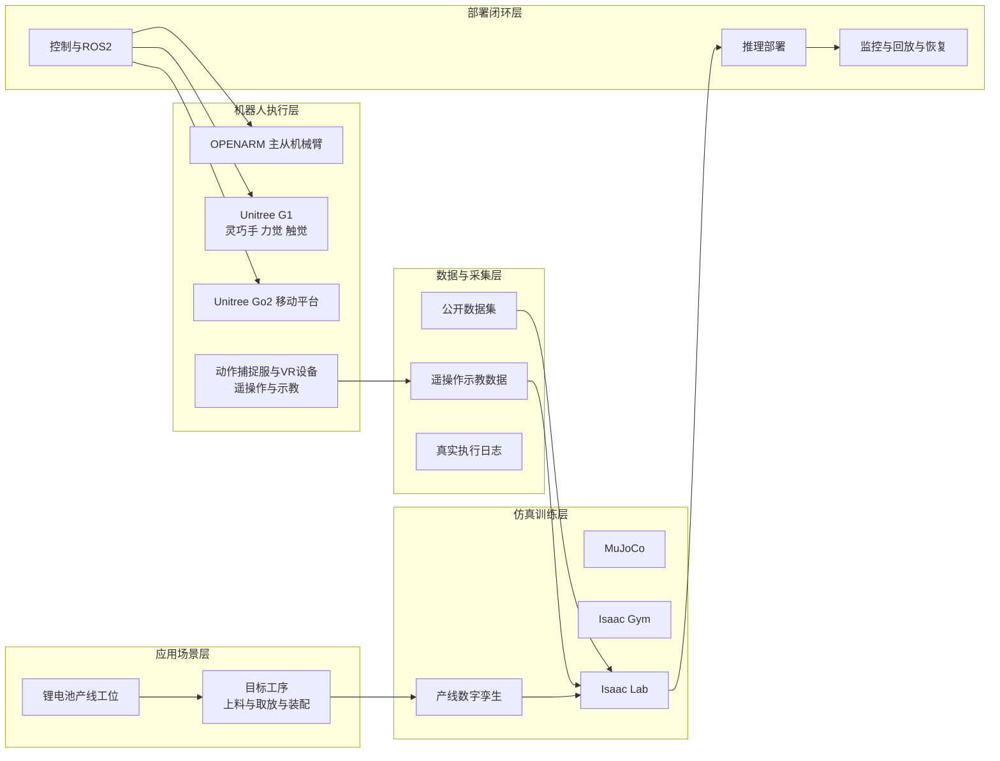

# 锂电池产线具身机器人部署规划（PPT 3页版）

> 两人团队、12个月周期：前6个月打通“数据采集-仿真训练-真实部署”闭环并完成抓取MVP，后6个月聚焦产线单工序数字孪生与自主作业落地。

## 关键论点

1. 以 OPENARM 抓取任务做MVP切入，快速验证闭环与工程化能力，降低早期风险。
2. 前6个月以公开数据集与公开仿真环境为主，快速复现 G1/Go2/OPENARM 基础能力并统一技术栈。
3. 后6个月只聚焦一个目标工序，围绕数字孪生、任务建模、sim2real和现场联调达成可验收成果。

## 证据

### 第1页：项目总览

- 现有硬件：Unitree G1（灵巧手+六维力/触觉）、Go2、OPENARM主从机械臂、动作捕捉服、VR设备
- 场景：锂电池装备生产线（叠片机、卷绕机等工位）
- 目标：替代人工完成装配与上料/取放流程
- 技术路线：MuJoCo + Isaac Gym + Isaac Lab，打通数据-仿真-部署闭环
- 总目标：12个月实现“自主完成一个工序”

### 第2页：12个月时间轴（每两个月一个里程碑）

| 时间段 | 里程碑 | 关键产出 |
| --- | --- | --- |
| 1-2个月 | M0 OPENARM抓取MVP基线 | 仿真抓取baseline可演示；工程骨架可用 |
| 3-4个月 | M1 数据闭环与多平台复现 | 遥操作采集-训练-评测可重复；G1/Go2/OPENARM基础Demo |
| 5-6个月 | M2 真机部署与阶段1验收 | 真机端到端闭环；目标工序冻结 |
| 7-8个月 | M3 工序建模与数字孪生v1 | 工序流程图与资产清单；训练环境v1可跑通 |
| 9-10个月 | M4 策略训练与真实适配 | 仿真单工序全流程成功；真实工位初步闭环 |
| 11-12个月 | M5 现场联调与最终验收 | 连续稳定演示；自主完成一个工序验收 |

### 第3页：里程碑与分工（2人）

- 关键里程碑
  - M0（1-2个月）：OPENARM抓取MVP基线完成
  - M1（3-4个月）：数据闭环可重复 + 多平台基础能力复现
  - M2（5-6个月）：真机闭环 + 阶段1验收 + 工序冻结
  - M3（7-8个月）：数字孪生v1可训练
  - M4（9-10个月）：仿真全流程成功 + 真实初步闭环
  - M5（11-12个月）：现场联调稳定 + 最终验收
- 两人分工
  - 仿真/算法：任务环境、训练框架、策略训练、sim2real、评测体系
  - 系统/部署：硬件接口、ROS2/控制、遥操作采集、安全机制、现场联调与运维
- 风险控制（汇报版）
  - 只做一个工序、一个主交付机器人形态
  - 公开环境优先，真实数据用于校正与鲁棒性提升
  - 重点建设异常恢复与日志回放，保证可验收与可运维

## 开放问题

- 目标工序最终选择与验收口径（建议优先上料/治具取放）
- 主交付机器人形态（固定工位优先OPENARM；需移动则评估Go2+臂）
- 现场约束（标定、光源与相机、PLC/设备交互、安全规范与窗口）

## 启示

- 用“闭环验证优先”的两阶段策略，在2人团队约束下最大化里程碑可见性与风险可控性。

## 相关

- [[锂电池产线具身机器人部署规划]]
- [[Isaac Lab]]
- [[OpenARM]]
- [[遥操作（Teleoperation）]]
- [[Wiki 目录]]
