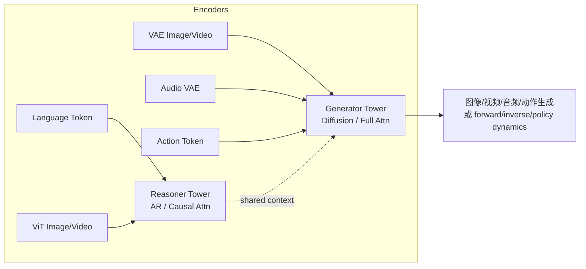
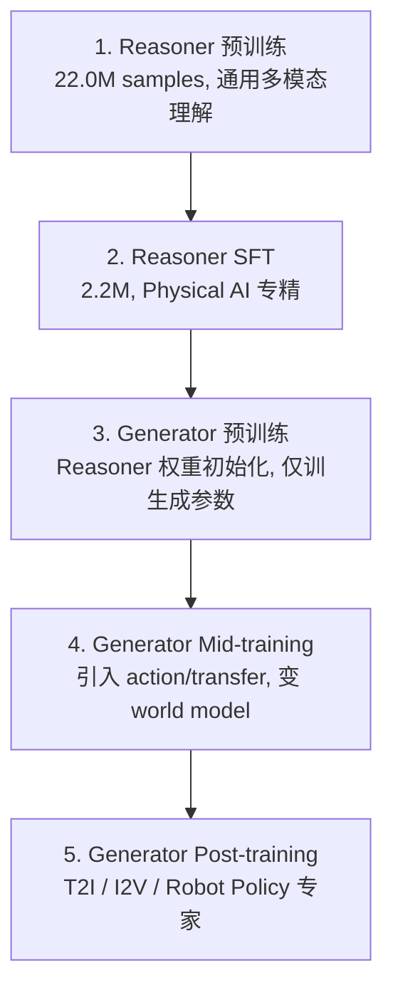

# 资料摘要：Cosmos 3 Omnimodal World Models

> NVIDIA Cosmos 3 技术报告解读。核心是把"VLM 看图、world model 预测视频、policy 预测动作"这一类原本分立的能力合进**同一个 omnimodal world model**——同一个系统既能回答场景是否物理合理，也能按动作预测未来视频，还能从视频反推动作。其骨架是一个 two-tower Mixture-of-Transformers（MoT）：Reasoner（自回归塔）负责理解/推理，Generator（扩散塔）负责生成/仿真，二者共享注意力上下文、单向条件化（Reasoner→Generator，不反向污染）。

## 核心要点

- **从多专用模型到一个 omnimodal world model**：Cosmos 1/2 把 physical understanding、world generation、controlled generation 做成不同能力；Cosmos 3 把它们统一进一个框架，覆盖 text / image / video / audio / action 五种模态。
- **Two-tower MoT 架构**：Reasoner 是 autoregressive tower（causal self-attention，next-token prediction），做语言、视觉理解、物理与空间推理；Generator 是 diffusion transformer tower（full attention，rectified-flow denoising），生成图像/视频/音频/动作。每层两套路由参数，Generator 可经 joint attention 看到 Reasoner 上下文，但 AR token 不看 DM token。
- **Action 是第一类公民**：支持 forward dynamics（给起始帧+动作→预测未来观测）、inverse dynamics（给视频变化→反推动作）、policy generation（给语言+视觉观测→直接生成动作轨迹）。
- **五阶段训练**：Reasoner 预训练 → Reasoner SFT（Physical AI 专精）→ Generator 预训练（用 Reasoner 权重初始化）→ Generator Mid-training（引入 action / transfer，变成 world model）→ Generator Post-training（分化出 T2I / I2V / Robot Policy 等专家）。
- **Robot Policy 实证**：Post-training 在 DROID 数据（76K 轨迹、350 小时、86 任务、564 场景）上得到 `Cosmos3-Nano-Policy-DROID`（16B 级），输入语言+视觉观测输出机器人动作，可与 forward/inverse dynamics 共享同一生成框架。
- **合成数据补齐长尾**：Mid-training 引入 5 类 SDG 合成数据（PhyxSim / RobotSim / DriveSim / SynHuman / Warehouse），单一 SDG 有 domain bias，混合 SDG-All 稳定提升多个 Physical AI 维度。

## 详细笔记

### 两塔 MoT 架构

Cosmos 3 是一个 **AR-DM hybrid omnimodal transformer**：

- **AR subsequence / Reasoner**：处理语言 token + ViT 编码的 image/video understanding token，causal self-attention 做 next-token prediction（类 VLM）。
- **DM subsequence / Generator**：处理 VAE 编码的 image/video latent、audio latent、action token，训练目标是 diffusion / rectified-flow denoising，推理时 iterative denoising。
- **MoT backbone**：每层两套路由参数（Reasoner / Generator），Generator token 经 joint attention 可见 Reasoner context，但 Reasoner 不被 DM token 更新——保证语言生成的自回归一致性不被扩散目标泄漏破坏。

### Token 排列与生成模式

Token 序列固定为 `[AR subsequence, DM subsequence]`。AR 永远在 diffusion token 前；DM 内 clean conditioning 在前、noisy target 在后；conditioning 与 target 内部模态顺序为 vision → audio → action。不同模式：

- **Language**：仅 AR，Generator 不激活，即标准 VLM。
- **Text-to-Image / T2V / I2V / V2V / Video Transfer**：AR 作 prompt/condition，DM 去噪生成。
- **Action modes**：Forward Dynamics、Inverse Dynamics、Policy / Joint Video-Action Prediction（同时去噪未来视频与动作）。

### 五阶段训练流程

- 阶段 1 用 Qwen3-VL-Embedding-8B / PE-Core-G14-448 做语义去重（sim>0.95 删除 4.23%），Gemma-4-31B-it 做 AI-judge 质量过滤（threshold=2 保留 78%，threshold=5 保留 46%）。
- 阶段 2 SFT 聚焦 autonomous vehicle / robotics / smart infrastructure，pre-training:SFT = 1:4 防退化。
- 阶段 3 Generator 数据：767M images、347.7M video clips、138.9M audio clips。
- 阶段 4 Mid-training：image 15.6M、video 74.7M、video+audio 18.8M、action 8.4M episodes / 61.3K hours；5 类 SDG 合成数据补齐刚体动力学、机器人操作、自动驾驶长尾、数字人、仓库场景。

### Action 数据构成

action 总规模 8.4M episodes / 61.3K hours，四大来源：

- **Egocentric Motion**：1.7M episodes / 41.3K hours（67.4%），每手 21-keypoint 3D pose。
- **Autonomous Vehicle**：10.0K hours（16.3%），NVIDIA Hyperion 平台 in-house 驾驶日志。
- **Robotics**：5.4K hours / 90.4K tasks / 516.7K episodes（8.7%），用 state difference 构造 pseudo-actions 避免 controller 噪声。
- **Camera Motion**：4.6K hours（7.5%），用 ViPE + DepthAnything3 估计 pose，最终 1.9M clips。

### 实验结论

- **Reasoning**：Cosmos3-Super / Nano 在 VANTAGE-Bench 32B/8B tier 领先，temporal action reasoning 强。
- **Generation**：R-Bench / PAIBench-G / Physics-IQ / RoboLab 达 open-source SOTA 或领先，Robotics / Smart Space / Driving 开放模型平均第一。
- **Action / Robot Policy**：`Cosmos3-Nano-Policy-DROID` 输入语言+视觉观测输出动作轨迹，16B 级，非单纯 behavioral cloning，可受益于同一模型学到的视觉动态与物理约束。

## 引用与数据

- 模型卡：HuggingFace 将 Policy-DROID 列为 16B 级。
- DROID 后训练：76K trajectories / 350 hours / 86 tasks / 564 scenes，输入三视角拼接 540×640。
- 项目主页：<https://huggingface.co/blog/nvidia/cosmos-3-for-physical-ai>
- 技术报告：<https://research.nvidia.com/labs/cosmos-lab/cosmos3/technical-report.pdf>

## 相关

- [[NVIDIA Cosmos]]
- [[VLA（视觉-语言-动作模型）]]
- [[流匹配（Flow Matching）]]
- [[GR00T N1.5]]
- [[Isaac Lab]]
- [[Wiki 目录]]
