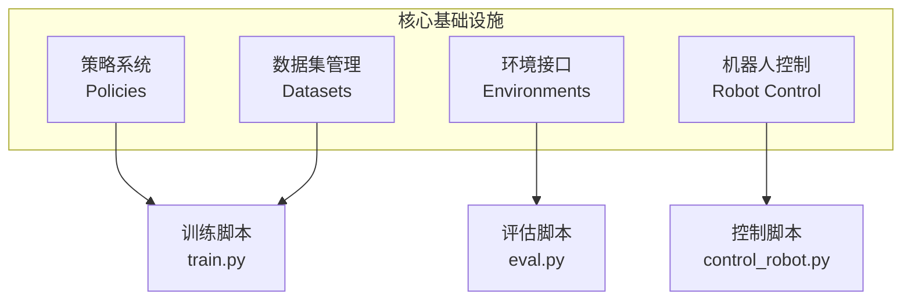

# 资料摘要：LeRobot 框架架构剖析

> 知乎深度文章，剖析 LeRobot 框架的系统架构、代码结构、策略系统和数据格式。

## 核心要点

- **设计理念**：降低机器人技术门槛，类似 Transformer 之于 NLP
- **四大子系统**：策略系统、数据集管理、环境接口、机器人控制
- **统一接口**：工厂模式创建策略、数据集、环境
- **数据格式**：LeRobotDataset（Parquet + 视频）

## 详细笔记

### 系统架构



### 代码结构

```
lerobot/
├── configs/          # 配置类
├── common/
│   ├── datasets/     # 数据集：aloha, pusht, xarm
│   ├── envs/         # 环境：aloha, pusht, xarm
│   ├── policies/     # 策略：act, diffusion, tdmpc
│   ├── robot_devices/# 硬件接口：电机、相机
│   └── utils/        # 工具函数
└── scripts/          # 命令行脚本
    ├── train.py
    ├── eval.py
    └── control_robot.py
```

### 支持的策略

| 策略 | 描述 | 适用场景 |
|------|------|----------|
| ACT | 动作分块 Transformer | 双手操作，长期依赖 |
| Diffusion | 去噪扩散模型 | 精确视觉引导任务 |
| TDMPC | 时间差分模型预测控制 | 动态环境导航操作 |
| VQBeT | 向量量化行为 Transformer | 多模态行为学习 |
| π0 | 视觉-语言-动作 | 语言指令引导任务 |

### 数据集结构

```
dataset/
├── data/
│   └── chunk-XXX/
│       └── episode_XXXXXX.parquet
├── meta/
│   ├── episodes.jsonl
│   ├── info.json
│   ├── stats.json
│   └── tasks.jsonl
└── videos/
    └── chunk-XXX/
        └── observation.images.cameraX/
            └── episode_XXXXXX.mp4
```

### 核心工厂函数

```python
make_policy()    # 创建策略
make_dataset()   # 创建数据集
make_env()       # 创建环境
```

## 引用与数据

- 框架：[LeRobot GitHub](https://github.com/huggingface/lerobot)
- 文档：[Hugging Face Docs](https://huggingface.co/docs/lerobot)

## 相关

- [[LeRobot]]
- [[ACT（动作分块变换器）]]
- [[资料摘要：LeRobot 官方教程]]
- [[Wiki 目录]]
