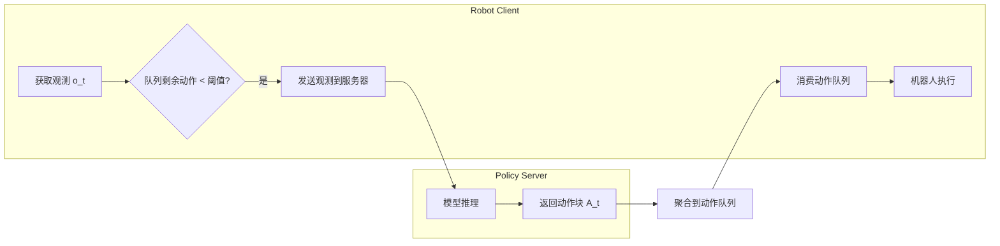

# 资料摘要：SmolVLA 轻量级 VLA 模型

> 开源轻量级视觉-语言-动作模型 SmolVLA，旨在消费级 GPU 上训练、CPU 上部署，性能媲美更大规模 VLA 模型。

## 核心要点

- **轻量级架构**：专为消费级 GPU（如 RTX 4090/5090）训练及 CPU 部署优化
- **数据高效**：仅用不到 3 万个公开样本，数据量比以往方法少一个数量级
- **异步推理**：将动作执行与观测处理解耦，降低延迟
- **性能对标**：体量更小，性能却媲美甚至超越更大规模的 VLA 模型

## 详细笔记

### 轻量级架构设计

| 设计策略 | 说明 |
|----------|------|
| 跳层处理 | 跳过 VLM 的部分层级 |
| 视觉 token 压缩 | 使用极少量的视觉 token |
| 小型 VLM | 利用小型预训练 VLM |
| 交错注意力 | 自注意力层与更轻量的交叉注意力层交错排列 |

### 训练数据

- 全部来自公开、社区贡献的数据集
- 总共不到 3 万个样本
- 端到端训练

### 异步推理架构

### 关键创新

1. **动作执行与推理解耦**
   - RobotClient 持续消费动作队列
   - 队列低于阈值时触发新推理
   - 消除运行时空闲间隙

2. **远程推理支持**
   - 策略可在远程 GPU 服务器运行
   - 机器人端可部署在低功耗设备

3. **观测去重**
   - 关节空间距离 < 阈值则视为重复
   - 避免冗余服务器调用

### 延迟分析

- 总延迟：`E[ℓ] = E[t_C→S] + E[ℓ_S] + E[t_S→C]`
- 主要瓶颈：推理延迟 ℓ_S
- 控制周期：33ms（30fps）

## 引用与数据

- 论文：[SmolVLA](https://arxiv.org/abs/xxx)
- 解读：[CSDN v_JULY_v](https://blog.csdn.net/v_JULY_v/article/details/148723688)

## 相关

- [[VLA（视觉-语言-动作模型）]]
- [[GR00T N1.5]]
- [[资料摘要：π*0.6 真实世界强化学习]]
- [[Wiki 目录]]
