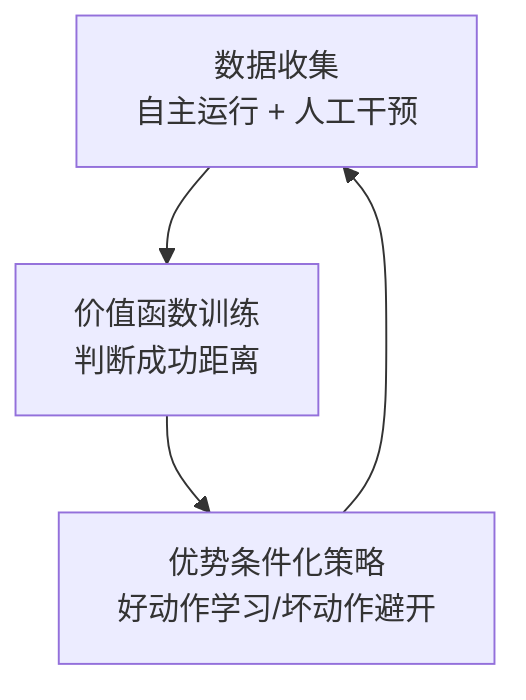

# 资料摘要：π*0.6 真实世界强化学习

> Physical Intelligence 发布的 π*0.6 模型解读，首次实现大规模真实世界强化学习训练，突破模仿学习的累积错误问题。

## 核心要点

- **核心创新**：RECAP（基于优势条件化策略的经验与纠偏强化学习）
- **训练范式**：预训练 → 监督微调 → 真实世界强化学习
- **关键组件**：价值函数 + 优势条件化策略
- **任务验证**：叠衣服、做咖啡、折盒子

## 详细笔记

### 为什么模仿学习不够？

- **累积错误**：小误差导致环境与训练数据不同，形成连锁反应
- **LLM vs 机器人**：LLM 出错仍可用，机器人连续交互出错直接失败
- **解决方案**：真实世界强化学习 + 人类纠正

### RECAP 三步流程

#### 1. 数据收集

- **预训练**：仅演示数据
- **后训练**：自主运行 + 人类专家纠正（接管并示范恢复）

#### 2. 价值函数训练

- 预测完成任务所需的剩余步数
- 识别失败，判断成功距离
- 随数据增加不断变强

#### 3. 优势条件化策略

- 优势分数 = 动作前后价值差
- 正优势 → 学习，负优势 → 避免
- 模型表现超越原始数据

### π0.6 vs π*0.6

| 特性 | π0.6 | π*0.6 |
|------|------|-------|
| 视觉语言骨干 | Gemma3 4B | 同左 |
| 动作专家 | 8.6 亿参数 | 同左 + 价值函数 |
| 训练方式 | 监督学习 | 离线强化学习 |
| 价值函数 | 无 | 670M 参数轻量模型 |

### 三项验证任务

| 任务 | 特点 | 改进 |
|------|------|------|
| 叠衣服 | 不确定性高，不同面料 | 吞吐量 + 成功率显著提升 |
| 做咖啡 | 长程任务，需等待设备 | 吞吐量和成功率翻倍以上 |
| 折盒子 | 复杂物理操作，corner case | 处理粘连盒子等异常情况 |

### 核心洞察

> 预训练 → 监督微调 → 强化学习，与 LLM 成功路径越来越接近。

## 引用与数据

- 论文：[π*0.6 PDF](https://www.pi.website/download/pistar06.pdf)
- 博客：[PI Official Blog](https://www.pi.website/blog/pistar06)
- 团队：Physical Intelligence (Sergey Levine, Chelsea Finn)

## 相关

- [[GR00T N1.5]]
- [[ACT（动作分块变换器）]]
- [[PPO（近端策略优化）]]
- [[RLHF（基于人类反馈的强化学习）]]
- [[Wiki 目录]]
