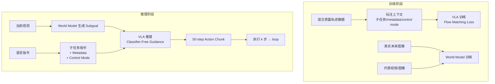

# 资料摘要：π0.7 多模态上下文条件化 VLA

> Physical Intelligence 新作 π0.7 论文深度解读。核心创新是多模态上下文条件化（Diverse Context Conditioning），通过子任务指令、subgoal images、episode metadata、control mode 四类上下文让 VLA 能从混合质量数据中学习可控策略。

## 核心要点

- **核心动机**：VLA 标准范式（语言指令 + 视觉 + 动作）无法区分数据中的行为质量差异，混入低质量轨迹会导致性能退化
- **解决方案**：每条轨迹带丰富上下文——子任务指令、subgoal images（由轻量 world model 生成）、episode metadata（速度/质量/错误标记）、control mode（joint/end-effector）
- **模型架构**：Gemma3 4B VLM + MEM video history encoder + 860M action expert（Flow Matching），50-step action chunk
- **关键发现**：metadata 让模型从更大但平均质量更低的数据中持续获益；无 metadata 时更多混合数据反而性能下降
- **模型能力**：零样本完成灵巧操作、跨 embodiment 迁移（非简单动作复刻而是策略重组）、语言 coaching 完成长程未见任务

## 详细笔记

### 多模态上下文条件化设计

| 上下文类型 | 内容 | 推理时来源 |
|-----------|------|-----------|
| 整体任务指令 | 最终目标（如 "clean up the kitchen"） | 固定输入 |
| 子任务指令 | 当前步骤（如 "open the fridge door"） | 高层语言策略 / human coaching |
| Subgoal Images | 多视角近未来目标图像 | 轻量 world model 生成 |
| Episode Metadata | speed / quality / mistake | 推理时固定为最高质量 |
| Control Mode | joint / end-effector | 根据任务选择 |

### 世界模型（World Model）

- 用于生成 subgoal images，而非 rollout 整段未来视频
- 目标：给定当前观测 + 子任务指令 + metadata，生成对 VLA 有用的近未来视觉目标
- 训练数据：机器人数据 + egocentric human video + 开源 image editing / video 数据集
- 训练时同时使用真实未来图像和 world model 生成图像，缓解 train-test mismatch

### 训练与推理流程

### 实验结果

- **灵巧任务**：通用 π0.7 匹配任务专用 RL specialist，laundry folding 和 box building throughput 更高
- **Prompt Ablation**：去掉 metadata 或 autonomous eval data 后性能下降，throughput 差距明显
- **指令跟随**：4 个未见厨房 + 2 个未见卧室，π0.7 比 π0.5/π0.6 显著提升
- **反数据偏置**：π0.7 能遵循「反向操作」指令而非复制数据常见模式
- **跨 embodiment**：从小型静态双臂迁移到 UR5e 单臂，π0.7 重新组织策略而非复刻动作轨迹
- **人类对比**：10 名 top 2% 遥操作专家平均 90.9% task progress / 80.6% success；π0.7(GC) 85.6% / 80%
- **长程 coaching**：通过人类逐步语言指导完成完全未见长程任务（如 loading air fryer）

### CFG（Classifier-Free Guidance）

动作 denoising 引导方向：`∇ = w · (log-policy(完整上下文) - log-policy(缺失上下文))`，强化 prompt 中指定的行为模式。应用于 episode metadata 上，诱导高质量、高速度、无错误行为。

### 补充：与 VISTA 的关系

π0.7 工作与 VISTA 有重叠（作者亦与 VISTA 作者交流）。二者共同指向一个趋势：用 World Model 生成 subgoal / 未来视觉目标作为 VLA 的上下文条件，已成越来越多人（WAM 等方式及 VLA + World Model 组合）的共识。作为行业龙头的 Physical Intelligence 在 π0.7 中正式拥抱世界模型，预示具身世界模型工作将持续涌现。

## 引用与数据

- 模型参数：Gemma3 4B VLM + 860M action expert（~4.86B 总参数量）
- Action chunk：50 steps（Flow Matching, 5 denoising steps）
- 推理时 RTC 模拟：0-12 timestep 延迟（50Hz 下 ≤ 240ms）
- 人类对比：10 人 × 3 次 = 30 次，平均 375 小时跨机器人遥操作经验
- 推理代价：最小 variant（3 相机、5 denoising steps、training-time RTC）约 38ms；启用 MEM encoder + subgoal images 最坏约 127ms（单张 H100）
- World Model：14B 级别，序列近 10,000 tokens，4-way tensor parallelism（4×H100）+ 8-bit 量化 + SageAttention，25 denoising steps 生成 subgoal images 约 1.25s；运行时异步执行，不阻塞 VLA 控制循环
- Prompt Dropout：训练时 subgoal images 仅用于 25% 样本；有 subgoal 的样本中子任务指令 30% 概率 drop；episode metadata 整体 15% 概率 drop（speed/quality/mistake 各自另 5% 单独 drop）；control mode 不 dropout

## 相关

- [[VLA（视觉-语言-动作模型）]]
- [[流匹配（Flow Matching）]]
- [[资料摘要：OpenPI π0 模型家族]]
- [[资料摘要：π*0.6 真实世界强化学习]]
- [[Wiki 目录]]
