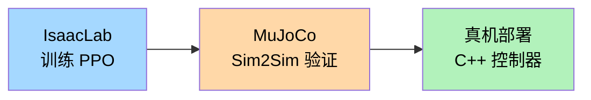

# 资料摘要：宇树 RL Lab（Unitree IsaacLab 训练框架）

> 宇树官方开源项目，基于 IsaacLab 构建的 Unitree 机器人强化学习集成环境，支持 Go2（四足）、H1（人形）、G1-29dof（人形）三种机器人，提供完整的 IsaacLab 训练 → MuJoCo Sim2Sim → 真机 Sim2Real 部署流水线。

## 核心要点

- **覆盖机型**：Go2（四足机器狗）、H1 / G1-29dof（人形机器人）
- **训练框架**：以 IsaacLab 为基础，使用 RSL-RL 进行 PPO 训练
- **部署流程**：IsaacLab 训练 → MuJoCo Sim2Sim 验证 → 真机 Sim2Real 部署
- **Sim2Sim**：通过 unitree_mujoco 验证训练策略在 MuJoCo 中的表现
- **Sim2Real**：编译 C++ 控制器（unitree_sdk2），通过网口直接控制真机

## 详细笔记

### 安装与使用

1. 安装 IsaacLab
2. 克隆 unitree_rl_lab 到独立目录，运行 `./unitree_rl_lab.sh -i` 安装
3. 下载宇树机器人模型文件（USD 或 URDF）
4. 验证：`./unitree_rl_lab.sh -l` 列出任务，`-t --task Unitree-G1-29dof-Velocity` 训练

### 部署流水线

### 依赖项目

| 项目 | 用途 |
|------|------|
| [IsaacLab](https://github.com/isaac-sim/IsaacLab) | 训练基础框架 |
| [unitree_mujoco](https://github.com/unitreerobotics/unitree_mujoco) | Sim2Sim 验证 |
| [unitree_sdk2](https://github.com/unitreerobotics/unitree_sdk2) | 真机通信 SDK |
| [unitree_ros](https://github.com/unitreerobotics/unitree_ros) | URDF 模型 |
| [unitree_model (HF)](https://huggingface.co/datasets/unitreerobotics/unitree_model) | USD 模型 |

### 与 LeRobot 训练框架的定位区别

| 维度 | unitree_rl_lab | unitree_lerobot (LeRobot) |
|------|---------------|--------------------------|
| 训练范式 | 强化学习（PPO） | 模仿学习（ACT/Diffusion） |
| 基础框架 | IsaacLab + RSL-RL | LeRobot |
| 输出策略 | 运动控制策略（行走/站立） | 操作策略（抓取/精细操作） |
| 应用场景 |  locomotion、移动控制 | 灵巧操作、任务执行 |

## 引用与数据

- 官方仓库：[unitreerobotics/unitree_rl_lab](https://github.com/unitreerobotics/unitree_rl_lab)
- 社区 fork：[chensisi0730/unitree_rl_lab](https://github.com/chensisi0730/unitree_rl_lab)（内容基本一致）
- 依赖：IsaacLab, MuJoCo, robot_lab, whole_body_tracking

## 相关

- [[Isaac Lab]]
- [[LeRobot]]
- [[资料摘要：资料摘要：宇树 LeRobot 训练框架]]
- [[遥操作（Teleoperation）]]
- [[Wiki 目录]]
