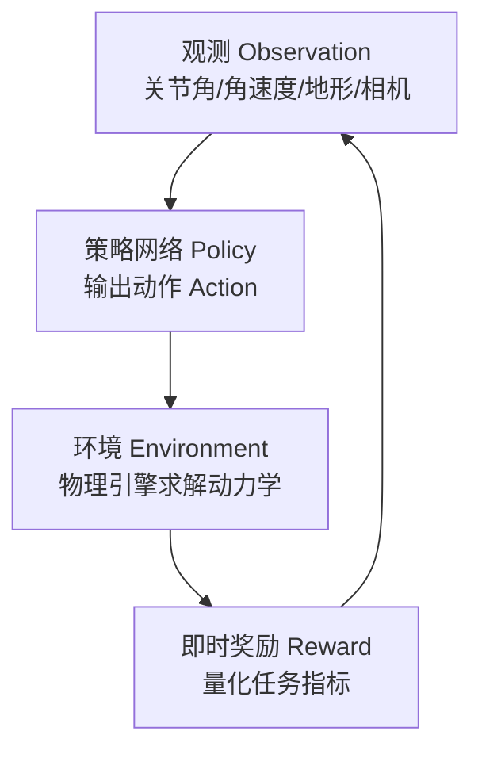

# 资料摘要：强化学习必备知识②机器人运动控制完整 pipeline

> 一篇系统梳理"从人工规则到数据驱动学习"在机器人运动控制（以四足机器人为例）如何落地的技术文章。覆盖基础闭环、分层控制、PPO 算法、特权信息蒸馏（Teacher-Student）、奖励函数设计、域随机化与 GPU 并行仿真等核心模块，是机器人强化学习工程管线的全景式入门。

## 核心要点

- **强化学习闭环四要素**：观测（Observation）、动作（Action）、环境（Environment）、即时奖励（Reward），抽象为 POMDP 局部观测空间下的策略迭代。
- **分层控制架构**：高层 DRL 策略网络（50 Hz，输出目标关节位置）+ 底层 PD 控制器（200 Hz–1000 Hz，把目标位置转为电机力矩）。"高层算位置、低层算力矩"降低训练难度、自带柔顺性、弥合虚实鸿沟。
- **PPO 是主流**：核心在于 clipping 截断机制，约束新旧策略概率比，限制单步梯度更新幅度，实现"小步快跑"的稳定收敛。
- **特权信息 + Teacher-Student 蒸馏**：仿真里机器人有"上帝视角"（地形高度、摩擦系数、重心），真机只有带噪局部传感器；先训全知 Teacher，再让学生仅用局部观测模仿（KL 散度蒸馏损失 + 任务奖励联合优化）。
- **奖励函数即方向盘**：靠速度跟踪/能耗/动作平滑/姿态等几项基础奖励，神经网络在亿级试错中自发涌现类动物步态（如 Trot）。
- **域随机化跨虚实鸿沟**：在仿真参数分布（质量、摩擦、电机延迟、传感器噪声）下最大化期望累积奖励，让策略在数千组"平行宇宙"中学会适应。
- **GPU 并行仿真提速**：Isaac Gym 把物理世界+网络搬上 GPU，单张 RTX 4090 同时模拟 4000+ 机器人、每秒近 10 万帧，把训练从数周压到数小时。

## 详细笔记

### 强化学习基础闭环



单步交互：`obs=env.reset()` → `action=policy(obs)` → `(next_obs, reward, done)=env.step(action)` → 存入 buffer → 更新策略。训练目标为最大化折扣累积回报。

### 分层控制架构


PD 力矩公式 `τ = Kp·(q_target − q) + Kd·(−q_dot)`。三大优势：①神经网络不必学底层力学，只定目标；②像弹簧吸收落地冲击、保护硬件；③兜底真实/仿真差异。

### PPO 截断机制

标准 PPO-Clip 目标：

```
θ_{k+1} = argmax_θ (1/|D|) Σ min( r_i(θ)Â_i, clip(r_i(θ), 1−ε, 1+ε)Â_i )
```

`r_i` 为新旧策略概率比，`Â_i` 为 GAE 优势，`ε` 工程取值约 0.2。新策略相对旧策略变化过大时强行截断，类比"教练每次只纠正一点点动作细节"。

### Teacher-Student 蒸馏

- 阶段 1：Teacher 输入完整特权信息 + 基础观测，在仿真训出全局最优运动策略。
- 阶段 2：Student 仅输入真机局部观测，以最小化师生策略 KL 散度为蒸馏损失，叠加任务奖励损失联合优化，复刻教师稳定运动行为。

### 域随机化

设可调参数向量 `ξ ~ p(ξ)`（质量、摩擦、电机延迟、传感器高斯噪声），优化目标 `max_θ E_{ξ~p(ξ)}[Σ γ^t r_t]`。每个 episode 初始化时对 `ξ` 各维度独立采样，等价于在数千组参数不同的仿真中迭代试错，部署到实体机器人后现实微扰多无显著影响。

## 引用与数据

- 控制频率：高层 DRL 50 Hz；底层 PD 200 Hz–1000 Hz。
- Isaac Gym：单张 RTX 4090 同时模拟 4000+ 机器人，每秒近 10 万帧训练数据。
- 四足步态（Trot）由速度跟踪 + 能耗 + 动作平滑 + 姿态四项奖励自发涌现。

## 相关

- [[PPO（近端策略优化）]]
- [[RLHF（基于人类反馈的强化学习）]]
- [[Isaac Lab]]
- [[NVIDIA Cosmos]]
- [[Wiki 目录]]
