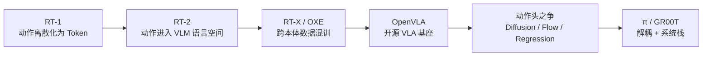

# 资料摘要：漫谈具身智能（1）VLA 简史

> 一篇 VLA 范式演进的"软综述"。核心观点：VLA 的历史，就是机器人动作在「大模型范式」和「物理控制现实」之间来回折中的历史。文章把 VLA 界定为**语义增强的无模型（model-free）策略**——不显式学习状态转移模型、不主要靠内部 rollout 选动作，因此刻意不覆盖世界模型路线，以便把脉络讲清楚。

## 核心要点

- **VLA 的本质是 Policy（策略模型）**：所有视觉/语言理解都服务于最终输出可执行的物理动作；主流语境下指 model-free 语义增强策略。
- **VLA 不是完整机器人智能**：在系统栈中处于中间层——之上是高层推理（Reasoning）做长视野任务分解，之下是底层高频控制器（Controller）保证物理安全。
- **六块拼图演进**：动作 token 化（RT-1）→ 动作进入 VLM 语言空间（RT-2）→ 跨本体数据混训（RT-X / OXE）→ 开源基座（OpenVLA）→ 动作头之争（Diffusion / Flow / Regression）→ 解耦与系统栈（π 系列 / GR00T）。
- **动作头演进 = 动作表达演进**：早期 AR 离散 token（天然契合 LLM，但慢且糙）→ 连续 Action Chunk（Diffusion 捏泥巴 / Flow Matching 顺水推舟 / Regression 盖章），从"打字机"走向"平滑连续轨迹"。
- **解耦架构成为主流**：π0 把"语义大脑（VLM backbone）+ 运动专家（Action Expert，Flow Matching）"解耦；GR00T N1 用 System 2（VLM 慢思考）+ System 1（DiT 快直觉）+ Runtime（WBC / Isaac Lab RL 兜底）双系统。

## 详细笔记

### VLA 的定义边界

文章明确收窄定义，避免发散：

1. VLA 本质是 Policy（动作 A 即策略输出）。
2. 主流指语义增强的 model-free 策略（"无模型"指不显式学状态转移、不主要靠 rollout 选动作，而非没有世界知识）。
3. 不含显式自我推演/规划的**世界模型**路线（与 Cosmos 系列互补，不对立）。
4. VLA 只是机器人系统栈中间层，需与 Reasoning、Controller 配合。

### 六块拼图

- **RT-1（第一块拼图）**：把连续动作切成均匀格子（Bins）离散化为 Action Token，控制问题改写成类机器翻译的自回归序列建模。FiLM 让语言早期参与视觉特征，TokenLearner 压缩特征使真实机器人跑到 3 Hz（35M 参数）。但 RT-1 从头训练，未用预训练 VLM 先验。
- **RT-2（真正的 VLA）**：把离散动作写成 tokenizer 可处理的文本字符串，进入 VLM 语言生成接口，通过联合微调把互联网语义知识转为物理动作能力（例："pick up the extinct animal" 依赖 VLM 语义推理 + 动作 token 化）。
- **RT-X / Open X-Embodiment（FLAN 时刻）**：用统一 Observation/Action/Language Schema 对齐 21 机构 34 实验室、22 种本体、100 万条轨迹、527 种技能的数据，证明跨本体混训可泛化；统一模型比各家小数据专用 Policy 平均成功率 +50%，开启"多机器人共享经验"时代。
- **OpenVLA（开源节点）**：DINOv2+SigLIP 视觉、Llama 2 7B 语言、OXE 数据、AR 离散 Action Head，提供完整代码权重，社区可用 LoRA/PEFT 微调到自有机器人。
- **动作头之争**：AR 慢且糙（逐 token 推理、离散 bins）；Diffusion（Octo/GR00T）多步去噪轨迹平滑但仍有延迟；Flow Matching（π0/π0.5）学速度矢量场、步数更少；Regression（OpenVLA-OFT）极快但易均值化、弱多峰建模。
- **从 VLA 到系统栈**：π 系列走向"语义大脑 + 运动专家"解耦；π0.7 引入 Steerable Generalist（用语言/metadata/control mode/视觉子目标显式改变行为风格）；GR00T 走向生态化（Cosmos 世界模型底座 + GRAIL 虚拟数据管线 + Isaac Lab RL 物理兜底）。

### 关键对照

| 维度 | AR（RT-2 / OpenVLA） | Diffusion（Octo / GR00T） | Flow Matching（π0） | Regression（OFT） |
|------|----------------------|---------------------------|---------------------|------------------|
| 动作形式 | 离散 Token | 连续 Chunk | 连续 Chunk | 连续 Chunk |
| 直觉 | 打字机 | 捏泥巴 | 顺水推舟 | 盖章 |
| 优点 | 契合 LLM | 多模态分布、平滑 | 路径简洁、步数少 | 速度极快 |
| 缺点 | 慢、糙、累积误差 | 多步去噪有延迟 | — | 均值化、弱多峰 |

## 引用与数据

- OXE：21 机构、34 实验室、22 种本体、100 万条轨迹、527 种技能。
- RT-X 跨本体混训：相对各家专用 Policy 平均成功率 +50%。
- RT-1 仅 35M 参数、真实机器人 3 Hz；GR00T N1 双系统（System 2 VLM + System 1 DiT + Runtime WBC）。

## 相关

- [[VLA（视觉-语言-动作模型）]]
- [[流匹配（Flow Matching）]]
- [[NVIDIA Cosmos]]
- [[GR00T N1.5]]
- [[Isaac Lab]]
- [[资料摘要：π0.7 多模态上下文条件化 VLA]]
- [[Wiki 目录]]
